# messq — Project Plan (Storage Engineer view)

**Author persona:** The Storage Engineer. The log is the product.
**Target:** Linux, Go 1.26+, single static binary (`CGO_ENABLED=0`).
**Design point:** 10 000 msg/s sustained at 1 KiB average payload on one commodity NVMe, with
publisher-acknowledged durability and no message loss across `SIGKILL` or power loss.

---

## 1. Vision & positioning

messq is a **durable log with ack semantics bolted on top** — not a broker with a persistence
feature bolted on the side. Every product claim in the README reduces to a storage claim:

| Product promise | Storage claim it actually is |
| --- | --- |
| At-least-once delivery | A publish returns only after its bytes are `fdatasync`'d into a segment |
| Replay from cursor / from start | Message bodies are immutable and never rewritten, so any past offset is still readable |
| Ack / nak / ack-timeout | Delivery state is *derived*, cheap, and recoverable — it never touches the body log |
| Dead-letter queue | A DLQ is just another stream, written with an ordering barrier before the source ack floor advances |
| "Follow a message end to end" | The audit trail is a second append-only log keyed by message ID |
| Simple ops | Retention is `unlink(2)` of whole segments — never a VACUUM, never a compaction pass |
| Understandable in an evening | One on-disk format, ~600 lines of it, documented byte-for-byte, with a `messq dump` that prints it |

**Positioning.** Kafka's durability model without ZooKeeper/KRaft, partitions, rebalancing,
or a JVM. NATS JetStream's ack vocabulary (ack / nak / term / in-progress / ack-wait /
max-deliver / max-ack-pending) without the clustering surface. Beanstalkd's operational
simplicity with a real on-disk log instead of a binlog you hope replays. Redis Streams'
consumer groups without the PEL that [grows without bound and never gets
reclaimed](https://redis.antirez.com/fundamental/streams-consumer-patterns.html).

**Explicit non-goals for 1.0:** replication, consensus, multi-node, exactly-once,
transactions across streams, tiered/object storage, JVM-scale partition counts.

**The one sentence a storage engineer would put on the box:** *messq never acknowledges a
publish it cannot prove it wrote, never rewrites a message it has written, and can always
tell you what happened to it.*

---

## 2. Architecture overview

### 2.1 Process model

One process, one data directory, one lock file (`LOCK`, `flock`'d — a second daemon on the
same directory refuses to start). No sidecars, no supervisor requirement beyond systemd.

```
                                messqd (single process)
 ┌──────────────────────────────────────────────────────────────────────────────────┐
 │  transport adapter (Connect/HTTP2 + Unix socket)  ── thin, no business logic ──┐  │
 │      publish RPC        consume bidi stream       admin RPC       /metrics     │  │
 └────────┬───────────────────────┬──────────────────────┬──────────────┬─────────┘  │
          │ appendReq             │ credits/ack/nak      │              │            │
 ┌────────▼───────────────────────▼──────────────────────▼──────────────▼─────────┐  │
 │                                 broker core (no net imports)                    │  │
 │                                                                                 │  │
 │  per stream:                                per consumer:                       │  │
 │   ┌─────────────────────────┐                ┌──────────────────────────────┐   │  │
 │   │ appender goroutine      │                │ dispatcher goroutine         │   │  │
 │   │  - assigns seq          │  lastSeq bcast │  - cursor, ackFloor          │   │  │
 │   │  - batches + encodes    │───────────────▶│  - pending map (bounded)     │   │  │
 │   │  - pwritev + fdatasync  │                │  - redelivery min-heap       │   │  │
 │   │  - rolls/seals segments │                │  - nak-delay min-heap        │   │  │
 │   └───────────┬─────────────┘                └───────────┬──────────────────┘   │  │
 │               │                                          │                      │  │
 │   ┌───────────▼────────────┐   ┌──────────────────┐  ┌───▼────────────────────┐ │  │
 │   │ mlog (segmented log)   │   │ tail cache       │  │ checkpointer goroutine │ │  │
 │   │  active + sealed segs  │   │ last 64 MiB RAM  │  │ (one, all consumers)   │ │  │
 │   └───────────┬────────────┘   └──────────────────┘  └───────────┬────────────┘ │  │
 │               │                                                  │              │  │
 │   ┌───────────▼────────────┐   ┌──────────────────┐  ┌───────────▼────────────┐ │  │
 │   │ retention GC goroutine │   │ journal writer   │  │ bbolt meta store       │ │  │
 │   │ (one, all streams)     │   │ (one, all evts)  │  │ messq.meta.db          │ │  │
 │   └────────────────────────┘   └──────────────────┘  └────────────────────────┘ │  │
 └─────────────────────────────────────────────────────────────────────────────────┘
```

### 2.2 Goroutine inventory (fixed, countable — no goroutine-per-message)

| Goroutine | Count | Owns | Blocking syscalls |
| --- | --- | --- | --- |
| `appender` | 1 per stream | active segment fd, seq counter, batch buffer | `pwritev`, `fdatasync` |
| `dispatcher` | 1 per consumer | cursor, pending set, timer heaps | none (reads via tail cache or `pread`) |
| `checkpointer` | 1 global | bbolt write txn | bbolt commit (`fdatasync` ×2) |
| `journal` | 1 global | journal segments | buffered `pwrite`, `fdatasync` every 200 ms |
| `retention` | 1 global | segment deletion | `unlink`, dir `fsync` |
| `reader` | pooled (≤ `GOMAXPROCS`) | serves cold replay from sealed segments | `pread` |
| transport | 2 per connection (net/http) | — | socket I/O |

Everything else is a channel hop. **No goroutine is spawned per message, per delivery or per
ack** — that is what keeps p99 stable at 10k msg/s.

### 2.3 Data flow: publish

1. Transport decodes a `PublishRequest` (1..N messages), validates size/subject, stamps
   `msg_id` (UUIDv7) and `trace_id`, sends `appendReq{recs, respCh}` to the stream appender.
2. Appender drains its channel non-blockingly into a batch (bounded by 256 records / 1 MiB /
   1 ms). Assigns sequences. Encodes into a reusable `[]byte`.
3. One `pwritev` of `[batch bytes | COMMIT frame]` at the active segment's write offset.
4. One `fdatasync`.
5. Tail cache updated; `lastSeq` broadcast wakes dispatchers; `respCh` replies to all waiters
   in the batch; journal gets N `publish` events (unsynced).

This is textbook **self-clocking group commit**: the appender never sleeps waiting for a
batch to fill — the batch is whatever accumulated while the previous `fdatasync` was in
flight. Under load the batch grows automatically; at low load a single publish syncs
immediately.

### 2.4 Data flow: deliver → ack

1. Dispatcher has credits (`max_ack_pending - len(pending)` > 0) and `lastSeq > cursor`.
2. Reads record: tail cache hit (hot path, no syscall) or `pread` from a segment (replay).
3. Emits `Message` on the consume stream. In memory: `pending[seq] = {attempt, deadline}`,
   push to redelivery heap. **No disk write.**
4. `Ack` arrives → remove from pending, advance ack floor if contiguous, mark dirty.
5. Checkpointer flushes dirty consumers every 250 ms / 1000 ops into bbolt (`DB.Batch`
   coalesces concurrent consumers into one commit).

---

## 3. Storage & durability design

### 3.1 The decision, stated plainly

> **messq stores message bodies in a custom segmented append-only log (`mlog`) and stores
> mutable metadata + consumer checkpoints in bbolt. It does not use SQLite.**

This is the single most consequential decision in the project, so here is the argument in
full.

**Why not SQLite/WAL for message bodies.** SQLite is an excellent engine for the wrong shape
of problem here.

- *One writer, always.* WAL mode fixes reader/writer blocking, not writer/writer. There is no
  FIFO for waiters — blocked writers race for the lock via OS file locks, so under sustained
  load you get [unbounded starvation with no "I am next in line"
  property](https://gauravsarma1992.medium.com/where-sqlite-gives-up-locks-writers-and-the-single-file-problem-69ea745d0c3b).
  We would end up building our own single-writer serialisation goroutine on top anyway — at
  which point SQLite is only providing B-tree pages we do not want.
- *Delete is the whole workload.* A work queue deletes everything it stores. In SQLite that
  means row deletes → free pages → either a growing file or `VACUUM` (a full rewrite that
  holds the write lock). Segment deletion in `mlog` is `unlink(2)`: O(1), no lock, no rewrite.
- *Write amplification per message.* Inserting a 1 KiB row dirties a 4 KiB page plus index
  pages plus WAL frames. `mlog` writes ~1.04 KiB per 1 KiB message (48 B record header +
  padding, amortised commit frame).
- *Checkpoint stalls.* `wal_autocheckpoint` moves WAL frames into the main DB in a burst,
  and `PRAGMA wal_checkpoint(TRUNCATE)` is a stop-the-world for writers. This is a p99 latency
  source we cannot explain to an operator in a one-line log message.
- *Durability knob buys nothing.* `synchronous=FULL` is the same `fsync` we would pay
  ourselves, just with less control over batching.
- *Replay and inspection.* "Read 40 GiB sequentially from offset X" is what a log file is
  for. It is what page-cache readahead is tuned for. A B-tree scan is not.

**Why not bbolt for message bodies.** bbolt is a copy-on-write B+tree. HashiCorp hit exactly
our workload with `raft-boltdb` and wrote it up when building `raft-wal`: BoltDB requires
**two fsyncs per append**, and after truncations "free space tracking issues" cause "later
appends to slow down". Our workload is append + head-truncate forever — the pathological case.
bbolt stays, but only where it is excellent (see §3.7).

**Why not an LSM (badger/pebble).** LSMs solve write amplification for *random* keys. Our keys
are monotonically increasing integers; a log already has perfect locality. We would pay
compaction CPU, compaction I/O, value-log GC, and a much larger operational surface to solve
a problem we don't have.

**Why a custom format is acceptable risk.** The format is ~5 frame types. It is frozen at M1,
fuzzed, covered by golden files from every released version, and shipped with `messq dump` and
`messq fsck`. Prior art we are deliberately copying: `hashicorp/raft-wal` (frame alignment,
commit frames, sealed-segment index frames, one fsync per append, preallocation) and Kafka
(segment rolling, sparse-index-in-sidecar idea, segment-granular retention).

### 3.2 Directory layout

```
$MESSQ_DATA/
├── LOCK                              # flock'd, contains pid + boot id
├── VERSION                           # "messq-store-1\n" — refuse to open newer
├── RESERVE                           # fallocate'd 64 MiB ENOSPC escape hatch (§3.9)
├── messq.meta.db                     # bbolt: definitions + consumer checkpoints
├── streams/
│   └── orders/
│       ├── log/
│       │   ├── 00000000000000000001-0000000000.seg   # sealed
│       │   ├── 00000000000000065537-0000000001.seg   # sealed
│       │   └── 00000000000000131073-0000000002.seg   # active
│       └── subject.idx               # derived, rebuildable, never authoritative
└── journal/
    ├── 00000000000000000001-0000000000.seg
    └── ...
```

Segment filenames are `<baseSeq:20d>-<segmentID:10d>.seg`. Base sequence gives lexicographic
= sequence order; the separate monotonic segment ID disambiguates after a tail truncation
that reuses a base sequence (the `raft-wal` trick — without it, truncate-then-append produces
two files claiming the same base and recovery cannot tell which is current).

### 3.3 Segment file format

All multi-byte integers little-endian. All frames start on an **8-byte boundary**, so a frame
header never straddles a 512 B sector — a partially written sector cannot half-corrupt the
header of the *next* good frame.

**Segment header — 64 bytes, written and fdatasync'd at creation:**

```
off  size  field
  0     8  magic       "MESSQSG\x01"
  8     2  format_ver  uint16  (=1)
 10     2  flags       uint16  (bit0: journal segment, bit1: sealed)
 12     4  seg_id      uint32
 16     8  base_seq    uint64  (sequence of first record, or 0 if empty)
 24     8  stream_hash uint64  (xxh-of-stream-name; guards against a segment moved between dirs)
 32     8  created_ns  int64
 40     4  target_size uint32  (bytes the file was preallocated to)
 44     4  reserved
 48     8  index_off   uint64  (0 while active; byte offset of INDEX frame once sealed)
 56     4  header_crc  uint32  (CRC32C over bytes 0..52)
 60     4  reserved
```

**Frame header — 8 bytes:**

```
0  1  type    uint8   0x01 RECORD  0x02 INDEX  0x03 COMMIT  0x04 PAD  0x05 TOMBSTONE
1  1  flags   uint8   bit0: payload is zstd-compressed (Phase 2)
2  2  rsvd    uint16
4  4  length  uint32  payload bytes, excluding padding to the next 8-byte boundary
```

**RECORD payload — 48-byte record header + variable body:**

```
 0   8  seq          uint64   redundant with position; makes every record self-describing
 8   8  ts_ns        int64    broker receive time, wall clock
16  16  msg_id       [16]byte UUIDv7
32   2  subject_len  uint16
34   2  hdr_len      uint16   serialised user headers
36   4  body_len     uint32
40   4  rec_crc      uint32   CRC32C over bytes 0..36 and over subject+headers+body
44   4  reserved
48   ..  subject | headers | body
```

`trace_id` lives in the user headers (`Messq-Trace-Id`) rather than the fixed header, so a
publisher's W3C `traceparent` passes through unmodified and we don't burn 16 fixed bytes on
messages that don't use it.

**COMMIT payload — 24 bytes, one per fsync batch:**

```
 0   8  last_seq     uint64
 8   8  commit_ns    int64
16   4  batch_crc    uint32   CRC32C over every byte written since the previous COMMIT frame
20   4  batch_recs   uint32
```

**INDEX payload — written once, at seal time:** `count uint32`, `pad uint32`, then `count ×
uint32` byte offsets (relative to segment start) of each RECORD frame in sequence order.
Lookup of `seq` in a sealed segment is `pread(4 bytes at index_off + 8 + 4*(seq-base_seq))`
followed by `pread` of the record — two syscalls, both page-cache-friendly, **O(1)**, no
binary search, no in-RAM index.

Cost: 4 B/record. A 128 MiB segment of 1 KiB messages holds ~131 k records → 512 KiB index
(0.4 % overhead). Of 128 B messages → ~1 M records → 4 MiB index (3 % overhead). Acceptable,
and it stays on disk: we never load a sealed index into the heap.

### 3.4 Two checksums, on purpose

`raft-wal` deliberately checksums only commit frames, deferring latent corruption to the
hardware, citing SQLite's stance. **messq disagrees, and here is the cost calculation that
justifies it:** CRC32C via `hash/crc32`'s Castagnoli table hits multiple GB/s on any SSE4.2
CPU. At 10 MB/s of message traffic that is well under 1 % of one core. For that price:

- **`batch_crc` in the COMMIT frame** detects a *torn write* — the tail of the file after a
  crash. Anything after the last valid COMMIT was never acknowledged to a publisher and is
  safely truncated.
- **`rec_crc` in each record** detects *latent corruption* — bit rot, a bad cable, a broken
  RAID rebuild, someone's `dd`. Without it, messq would hand a consumer a silently corrupt
  payload while claiming an audit trail. A product whose selling point is "you can prove what
  happened to this message" cannot ship that failure mode. `rec_crc` is verified on every read
  that leaves the tail cache, and by `messq fsck`.

### 3.5 fsync policy

Three modes, one default, all named in the config and in `messq storage stat` output.

| Mode | Publish acked after | Loss window on power loss | Cost |
| --- | --- | --- | --- |
| `strict` | `fdatasync` with zero batching delay | none | 1 fdatasync per *concurrent group*; throughput ≈ concurrency / fsync_latency |
| `batched` **(default)** | `fdatasync` of the group commit that contains it | none | ≤ `flush_interval` added latency |
| `relaxed` | `pwrite` returns (page cache) | up to `flush_interval` of published messages | background fdatasync |

`batched` defaults: `flush_interval=1ms`, `flush_records=256`, `flush_bytes=1MiB`. Crucially,
`strict` and `batched` differ *only* in whether the appender is willing to wait: both still
coalesce whatever is already queued. `relaxed` is never the default and `messq serve` logs a
`WARN` banner at startup when it is on.

`fdatasync` — not `fsync` — because segments are preallocated with
`unix.Fallocate(fd, FALLOC_FL_KEEP_SIZE, ...)`, so appends inside the preallocated region do
not change metadata that affects readability. Measured on NVMe, `fsync` is roughly
[2× the latency of `fdatasync`](http://smalldatum.blogspot.com/2020/10/innodb-fsync-and-fdatasync-reducing.html)
(≈3.6 ms vs ≈1.35 ms in one published measurement on a drive without power-loss protection;
tens of microseconds on enterprise drives with PLP). Halving the sync cost for free is worth
the discipline of never relying on `stat` size.

**Metadata durability rules (the parts people get wrong):**

- New segment: create `<name>.tmp` → `Fallocate` → write header → `fdatasync` → `rename` →
  `fsync(dir)`. Only then is it usable.
- Deleted segment: `unlink` → `fsync(dir)`. A segment that reappears after a crash is
  harmless (retention will re-delete it); one that vanishes early is not.
- Seal: write INDEX frame → COMMIT frame → `fdatasync` → rewrite header bytes 48..63
  (`index_off`, sealed flag, recompute `header_crc`) → `fdatasync`. A crash between the two
  leaves an unsealed-looking segment with a valid index that recovery simply re-derives.

### 3.6 fsync failure handling — the fsyncgate rule

Postgres spent 20 years assuming `fsync()` success meant "everything since the last fsync is
on disk"; on Linux, a failed writeback clears the error flag, so **a retried `fsync` returns
success while the data is gone**. ([fsyncgate](https://danluu.com/fsyncgate/))

messq's rule, non-negotiable:

> **Any error from `fdatasync` on a log segment is fatal and unretryable.**

On error, the daemon: logs `storage.fsync_failed` at ERROR with fd, path, errno, byte range,
and the affected sequence range; marks the stream `DEGRADED` (publishes rejected with
`RESOURCE_EXHAUSTED`, deliveries and acks continue so consumers can drain); and — with the
default `on_fsync_error=abort` — exits with code 70 after a 5 s drain. Restarting re-reads
the log from disk and re-derives the truth. `on_fsync_error=degrade` keeps the process alive
for operators who prefer the drain, and is documented as "you are now serving from a state
the kernel has disowned."

Read-side `EIO` is treated the same way for the affected segment: quarantine it (rename to
`.quarantine`, log `storage.segment_quarantined`), fail reads in its range loudly, keep every
other segment serving.

### 3.7 bbolt: what it stores and why it is the right tool *there*

bbolt holds `messq.meta.db`, containing:

```
stream/<name>              → StreamConfig proto (subjects, retention, limits, durability)
consumer/<stream>/<name>   → ConsumerConfig proto (ack_wait, max_deliver, backoff, filter)
ckpt/<stream>/<name>       → ConsumerCheckpoint (ack_floor, acked-above bitmap, attempt counts)
segdir/<stream>/<segid>    → SegmentMeta (base_seq, max_seq, bytes, records, sealed, created)
schema/version             → uint32
```

Justification grounded in the docs fetched from context7:

- bbolt's meta page carries `magic 0xED0CDAED`, a version, and an FNV-64a `checksum` over the
  page, validated on every open (`Meta.Validate`). Two alternating meta pages give crash-safe
  atomic commit. We get a self-verifying metadata store for free instead of writing a
  third format.
- `DB.Batch(fn)` "opportunistically combines" concurrent read-write transactions — exactly what
  we need for the checkpointer, where 20 consumers going dirty in the same 250 ms window
  become one commit (and therefore one pair of fsyncs) instead of 20.
- bbolt's own guidance to set `FillPercent = 0.9` for append-only workloads applies to
  `segdir/`, whose keys are monotonic segment IDs.
- The double-fsync-per-commit cost that disqualifies bbolt for the body log is irrelevant
  here, for the reason `raft-wal` gives: metadata is orders of magnitude smaller than log
  data. At 100 GiB of segments, `segdir` is a few hundred KiB — the freelist never exceeds a
  page, so `NoFreelistSync` and the hashmap freelist type are options we deliberately do
  **not** need.

**bbolt never stores a message body.** That rule is enforced by a test that asserts
`messq.meta.db` stays under 16 MiB in the 24 h soak.

### 3.8 Consumer state: the part nobody else gets cheap

Naively, an ack is a durable write: 10 000 acks/s → 10 000 durable state updates/s → with
bbolt's two fsyncs per commit, 20 000 fsyncs/s. Physically impossible. Every queue that tries
it either lies about durability or falls over. So messq **derives** consumer state:

```go
type consumerState struct {
    ackFloor     uint64            // every seq <= ackFloor is acked, permanently
    ackedAbove   *bitset           // acked seqs in (ackFloor, ackFloor+window]
    pending      map[uint64]inflight // bounded by max_ack_pending
    attempts     map[uint64]uint16   // only for seqs above the floor
    lastDelivered uint64
}
```

- **In-flight state is never written to disk.** A crash means every in-flight message is
  redelivered. That is *exactly* what at-least-once promises, so the cheapest correct
  implementation is to write nothing.
- **`ackedAbove` and `attempts` are bounded by `max_ack_pending`** (default 1024). This is the
  structural answer to Redis Streams' PEL problem, where "a pending entry that nobody
  acknowledges never goes away and stays in the PEL forever." In messq an unacked message
  consumes one credit; when credits run out, delivery stops and `messq consumer info` shows
  `floor_blocked_by_seq` and `oldest_pending_age`. The failure is loud and bounded instead of
  silent and unbounded.
- **Checkpoints are periodic, not per-ack.** Flushed when dirty and (250 ms elapsed OR 1000
  ops). Size: 8 B floor + ⌈max_ack_pending/8⌉ bitmap + a small attempt map ≈ 200 B–8 KiB.
- **The loss window is duplicates, never loss.** Crashing 250 ms after a burst of acks
  redelivers up to `250ms × ack_rate` messages ≈ 2500 at 10k/s. Set
  `checkpoint_interval=0` for per-batch-durable acks if your consumer is not idempotent and
  you accept the fsync cost.
- **Two ordering barriers are mandatory:**
  1. A checkpoint that advances `ackFloor` past sequence *S* must be durable **before**
     retention may delete a segment containing *S*.
  2. A DLQ append must be durable **before** the source consumer's floor advances past the
     dead message. Otherwise a crash in between loses it entirely. DLQ traffic is rare, so the
     extra `fdatasync` costs nothing measurable.

### 3.9 Retention, GC and the disk-full trap

**Deletion granularity is a whole sealed segment. Never a message.** A segment is deletable
when *all* of:

- it is sealed;
- `max_seq(segment) <= min(ackFloor)` across all consumers on the stream, for
  `retention=workqueue`; or the segment falls outside `max_age` / `max_bytes` / `max_msgs`
  for `retention=limits`;
- its deletion is not blocked by an active replay reader (refcount).

Retention modes: `workqueue` (default for job queues — delete once everyone acked),
`limits` (keep by time/size/count regardless of acks; this is what makes replay useful), and
`interest` (workqueue, but only consumers that existed when the message was published count).

`max_bytes` is a **hard cap that always applies**, even in `workqueue` mode. When it is hit:
`on_full=block` (default) rejects publishes with `RESOURCE_EXHAUSTED` and a message naming
the consumer that is stuck; `on_full=drop_oldest` deletes the oldest sealed segment, emits
`stream.dropped_oldest` at WARN with the exact sequence range dropped, and bumps a counter
that an operator can alert on. Data loss, if configured, is always an auditable event.

**The ENOSPC escape hatch.** At startup messq `Fallocate`s `RESERVE` (default 64 MiB). On the
first `ENOSPC` anywhere, it deletes `RESERVE`, enters `DEGRADED` (publish rejected;
deliveries, acks, checkpoints and retention still work), and logs `storage.enospc` at ERROR.
This prevents the classic broker deadlock where the disk is full, so the broker cannot write
the checkpoint that would let retention free space. Also: refuse to start if free space is
below `min_free_bytes` (default 256 MiB), and expose `messq_storage_free_bytes` so it can be
alerted on before it matters.

### 3.10 Page cache, readahead, and the 10k msg/s budget

**No mmap.** The body log is read and written with `pread`/`pwritev` only. mmap would give us
`SIGBUS` — an unrecoverable signal in Go — on ENOSPC while writing to a mapping, or on any
truncation of a mapped file
([golang/go#36109](https://github.com/golang/go/issues/36109)), and it hides I/O errors that
we specifically want as `error` values. mmap's win is avoiding a copy; we avoid the copy that
matters (hot deliveries) with a userspace tail cache instead.

**Tail cache.** The last `tail_cache_bytes` (default 64 MiB) of each stream is kept in a
ring buffer of already-encoded records. Live consumers — the overwhelmingly common case —
are served from RAM with zero syscalls. This is what makes 10k msg/s × N consumers cheap:
delivery cost is a slice header and a `Send`.

**Cold replay must not evict the hot tail.** A replay from sequence 1 over 40 GiB would
otherwise blow the page cache and tank live publish latency. So a reader that is more than
one segment behind:

- opens the segment and calls `unix.Fadvise(fd, 0, 0, POSIX_FADV_SEQUENTIAL)` to get
  aggressive readahead;
- calls `unix.Fadvise(..., POSIX_FADV_DONTNEED)` on each segment after finishing it, returning
  those clean pages to the kernel.

**Budget at 10 000 msg/s × 1 KiB:**

| Resource | Consumption | Headroom |
| --- | --- | --- |
| Log write bandwidth | ~10.4 MB/s | trivial for any SSD |
| CRC32C (record + batch) | ~21 MB/s hashed, <1 % of a core | fine |
| `fdatasync` calls | ≤1000/s with a 1 ms window; typically 200–600/s once batches self-clock | at 300 µs each → ~30 % of one syncing thread |
| `fdatasync` calls *without* group commit | 10 000/s required → needs <100 µs each with zero queueing | **infeasible** — this is why group commit is not optional |
| Segment rolls | 128 MiB / 10.4 MB/s ≈ one per 12 s (~300/hour) | ext4 htree handles it; `max_open_segments=64` LRU fd cache |
| Consumer checkpoints | 4/s per consumer, coalesced by `DB.Batch` | negligible |
| Journal writes | 3–5 events/msg ≈ 40 k events/s × ~64 B = 2.5 MB/s, fsync every 200 ms | 5/s fsyncs |
| Publish latency | p50 ≈ fdatasync latency (0.05–1 ms); p99 ≈ `flush_interval` + fdatasync | target p99 < 5 ms |

**Fewer, larger fsyncs is the entire performance story.** The
[group-commit self-clocking result](https://arxiv.org/pdf/2606.18187) says the tuning is not
even very sensitive: above a device-set load threshold the batch size converges on its own.
So we ship one knob (`flush_interval`) and a histogram (`messq_fsync_duration_seconds`) and
tell operators to leave it alone.

### 3.11 Crash recovery, step by step

```
1. flock(LOCK); read VERSION; refuse if store format > known.
2. Open messq.meta.db (bbolt validates its own meta page checksums).
3. For each stream:
   a. readdir log/, parse names, sort by (base_seq, seg_id).
   b. For each segment except the last: validate header CRC + sealed flag + index_off
      in range. Trust the contents.            <-- O(1) per segment, 100 GiB opens in <2 s
   c. For the last (active) segment: scan frames from offset 64.
        - track offset of the last COMMIT frame whose batch_crc verifies
        - stop at: bad magic/type, length beyond EOF, failed batch_crc, or EOF
      Then ftruncate to end-of-last-good-COMMIT; fdatasync; fsync(dir).
      Log storage.tail_truncated{bytes_dropped, seq_from, seq_to, reason}.
   d. Rebuild the active segment's in-memory offset index from that scan.
   e. Reconcile segdir/ in bbolt against what is on disk. Disk wins.
      Extra file with valid header -> adopt. Missing file -> drop entry, log WARN.
4. For each consumer: load ckpt/, clamp ack_floor into [first_seq, last_seq] of the stream
   (a purge may have moved first_seq forward). Pending set starts empty -> everything
   in flight at crash time will be redelivered. Log consumer.recovered{floor, clamped}.
5. If subject.idx is missing/stale, mark for background rebuild. Serve without it meanwhile.
6. Verify DLQ barrier: for each consumer, if a checkpoint claims a floor past a message
   marked dead but the DLQ stream has no record with that origin seq, re-dead-letter it.
7. Ready.
```

Two invariants recovery enforces, restated because they are the whole contract:

- **Nothing a publisher was told "ok" about is ever discarded** (it was inside a
  fdatasync'd COMMIT).
- **Nothing after the last valid COMMIT is ever exposed** (no publisher was told "ok").

**No derived structure is ever authoritative.** `subject.idx`, `segdir/`, and sealed INDEX
frames are all rebuildable by scanning segments. NATS learned this the hard way when
regenerating `index.db` could
[corrupt a stream's subject state](https://github.com/nats-io/nats-server/issues/4842).
`messq fsck --rebuild-indexes` deletes every derived artefact and reconstructs from records.

---

## 4. Delivery semantics & message lifecycle

### 4.1 Per-message-per-consumer state machine

```mermaid
stateDiagram-v2
    [*] --> UNSEEN: append committed (fdatasync)
    UNSEEN --> INFLIGHT: deliver / credits>0 / attempt++
    INFLIGHT --> ACKED: Ack
    INFLIGHT --> SCHEDULED: Nak(delay>0)
    INFLIGHT --> UNSEEN: Nak(delay=0) / attempt < max_deliver
    INFLIGHT --> UNSEEN: ack_wait expiry / attempt < max_deliver
    INFLIGHT --> INFLIGHT: InProgress (extend deadline)
    INFLIGHT --> DEAD: Term
    INFLIGHT --> DEAD: (expiry or Nak) and attempt >= max_deliver
    SCHEDULED --> UNSEEN: delay elapsed
    SCHEDULED --> DEAD: attempt >= max_deliver
    ACKED --> [*]: floor advances; segment eligible for GC
    DEAD --> [*]: DLQ append durable, then floor advances
```



### 4.2 Transition table (authoritative)

| Event | Guard | In-memory effect | Durable effect | Journal event |
| --- | --- | --- | --- | --- |
| `publish` | size ≤ `max_msg_size`, subject matches stream | seq assigned, tail cache push | **record + COMMIT fdatasync'd** | `publish` |
| `deliver` | `len(pending) < max_ack_pending` ∧ `attempt < max_deliver` ∧ credits > 0 | `attempts[seq]++`, `pending[seq]={deadline: now+ack_wait}`, heap push | none | `delivery` (attempt, delivery_id) |
| `ack` | seq ∈ pending ∨ seq ≤ floor (idempotent) | drop from pending; advance floor over contiguous `ackedAbove` | checkpoint (async, ≤250 ms) | `ack` |
| `nak(delay)` | seq ∈ pending | drop from pending; if `attempt < max_deliver` push to nak-delay heap at `now+delay` else → DEAD | none | `nak` (delay, attempt) |
| `in_progress` | seq ∈ pending | `deadline = now + ack_wait` | none | `progress` (debug level) |
| `term` | seq ∈ pending | → DEAD immediately, ignoring `max_deliver` | DLQ append fdatasync, then checkpoint | `term` |
| `ack_wait expiry` | `now > deadline` | drop from pending; → UNSEEN or DEAD as above | none | `timeout` + `redelivery` |
| `dead` | `attempt ≥ max_deliver` | remove from pending | **DLQ append fdatasync → then** floor may advance | `dlq` (reason, attempts) |
| `seek(pos)` | consumer paused or `--force` | floor := pos-1, clear pending/attempts/ackedAbove | checkpoint fdatasync (synchronous) | `seek` (from, to) |
| `purge(range)` | admin | first_seq advances; consumers clamped | segment deletions + checkpoint | `purge` (range, bytes freed) |

**Delivery attempt counting is at delivery time, not at failure time.** A consumer that
receives a message and is `SIGKILL`'d has still burned an attempt. This is the only definition
that survives a broker crash without durable in-flight state, and it matches JetStream.

**Nak backoff** is a per-consumer list, default `[1s, 5s, 30s, 2m, 10m]`, last value repeated,
`±10 %` jitter. `nak(delay)` from the client overrides it.

**Max-deliver behaviour**, and the difference from JetStream: in JetStream, exceeding
`MaxDeliver` simply stops redelivery and the message sits in the stream. messq makes the
outcome explicit per consumer:

- `on_max_deliver=dlq` (default): append to the DLQ stream `<stream>.DLQ` with headers
  `Messq-Origin-Stream`, `Messq-Origin-Seq`, `Messq-Origin-Msg-Id`, `Messq-Attempts`,
  `Messq-Dead-Reason` (`ack_wait` | `nak` | `term`), `Messq-Dead-At`. The DLQ is a real stream
  — same publish/consume/replay/inspect tooling, its own retention. `messq dlq replay` copies
  messages back to the source stream as *new* messages (new seq, new msg_id, header
  `Messq-Replay-Of` preserving the original id).
- `on_max_deliver=hold`: the message becomes `HELD` — invisible to delivery, visible to
  `messq inspect --held`, and it **blocks the ack floor** (and therefore retention). Capped by
  `max_held` (default 10 000); exceeding the cap forces DLQ mode and logs at ERROR. This is the
  "keep for inspection" option, with its cost stated up front.

### 4.3 Ordering

The stream is totally ordered: one appender assigns sequences under one lock, so per-subject
order is a consequence, not an extra mechanism. Delivery order is where care is needed:

- Default: messages are delivered in sequence order, but with `max_ack_pending > 1` a consumer
  may complete them out of order. That is correct for a job queue.
- `ordered_by=subject`: the dispatcher keeps a per-subject in-flight lock. A subject with an
  outstanding delivery is skipped until it acks, terms or dead-letters. Cost: head-of-line
  blocking per subject, and a `subject → seq` map bounded by `max_ack_pending`. This gives
  true per-subject ordering with parallelism *across* subjects.
- `max_ack_pending=1`: strict global ordering for that consumer.

### 4.4 Flow control

Credit-based, client-driven. On `Consume`, the client sends `Init{max_in_flight}`; the server
never has more than `min(client credits, consumer.max_ack_pending)` unacked messages
outstanding. Credits are returned by acks or by an explicit `Flow{credits}` frame. When
credits hit zero the dispatcher stops reading — backpressure propagates to the socket, then to
the tail cache, then (only if `max_bytes` is reached) to publishers. Every stage is visible:
`messq_consumer_credits`, `messq_consumer_pending`, `messq_stream_backlog_bytes`.

---

## 5. API / protocol

**Decision: Connect RPC (`connectrpc.com/connect`) over HTTP/2 h2c on one TCP port, plus the
same handlers on a Unix domain socket at `$MESSQ_DATA/messq.sock`.**

Why Connect and not raw gRPC or a bespoke binary protocol:

- One handler set speaks three protocols: the Connect protocol (plain HTTP/1.1 + JSON —
  `curl`-able, which is the whole "readable ops" promise), gRPC, and gRPC-Web. An operator
  debugs with `curl`; a Go/Java/Rust service uses a generated gRPC client; nobody writes a
  framing parser.
- Streaming is first-class: from the docs fetched via context7, `connect.NewServerStreamHandler`
  and `connect.NewBidiStreamHandler` with `*connect.BidiStreamForHandler[Req, Res]` give
  exactly the `Receive()`/`Send()` loop the consume path needs, including
  `conn.ResponseHeader()` before the first `Send` and trailers on exit.
- Unix socket gives local CLI access with filesystem permissions instead of a token.

Wire format is protobuf (`messq/v1/*.proto`, generated with `buf`). Bodies are `bytes`;
headers are `map<string,string>` capped at 4 KiB; `max_msg_size` defaults to 1 MiB.

```protobuf
service PublishService {
  rpc Publish(PublishRequest) returns (PublishResponse);            // batch of 1..N
  rpc PublishStream(stream PublishRequest) returns (stream PublishAck); // pipelined
}

service ConsumeService {
  // bidi: client -> Init | Flow | Ack | Nak | InProgress | Term
  //       server -> Message
  rpc Consume(stream ConsumeRequest) returns (stream ConsumeResponse);
  rpc Fetch(FetchRequest) returns (FetchResponse);   // simple pull, used by CLI + scripts
}

service AdminService {
  rpc CreateStream(CreateStreamRequest) returns (StreamInfo);
  rpc UpdateStream(UpdateStreamRequest) returns (StreamInfo);
  rpc ListStreams(ListStreamsRequest)   returns (ListStreamsResponse);
  rpc GetStream(GetStreamRequest)       returns (StreamInfo);
  rpc DeleteStream(DeleteStreamRequest) returns (Empty);

  rpc CreateConsumer(CreateConsumerRequest) returns (ConsumerInfo);
  rpc GetConsumer(GetConsumerRequest)       returns (ConsumerInfo);
  rpc Seek(SeekRequest)                     returns (ConsumerInfo);
  rpc ResetConsumer(ResetConsumerRequest)   returns (ConsumerInfo);

  rpc Peek(PeekRequest)   returns (PeekResponse);          // non-destructive read by seq
  rpc Trace(TraceRequest) returns (stream JournalEvent);   // everything about one msg_id
  rpc Purge(PurgeRequest) returns (PurgeResponse);
  rpc DlqReplay(DlqReplayRequest) returns (DlqReplayResponse);
}

service StorageService {                       // the persona's API
  rpc ListSegments(ListSegmentsRequest) returns (ListSegmentsResponse);
  rpc StorageStat(Empty)                returns (StorageStatResponse);
  rpc Verify(VerifyRequest)             returns (stream VerifyProgress); // fsck over RPC
  rpc Snapshot(SnapshotRequest)         returns (stream SnapshotChunk);
}
```

Key message shapes:

```protobuf
message Message {
  uint64 seq = 1;  bytes msg_id = 2;  string subject = 3;
  map<string,string> headers = 4;  bytes body = 5;
  int64 ts_ns = 6;  uint32 attempt = 7;  uint64 delivery_id = 8;  int64 ack_deadline_ns = 9;
}
message ConsumerInfo {
  string stream = 1; string name = 2;
  uint64 ack_floor = 3; uint64 last_delivered = 4; uint64 stream_last_seq = 5;
  uint64 lag = 6;                     // stream_last_seq - ack_floor
  uint32 pending = 7; uint32 redelivered = 8; uint64 dlq_total = 9;
  uint64 floor_blocked_by_seq = 10;   // 0 if not blocked
  int64  oldest_pending_age_ns = 11;
  int64  checkpoint_age_ns = 12;
}
```

Also served on the same mux: `GET /healthz` (process alive), `GET /readyz` (recovery complete,
no stream `DEGRADED`), `GET /metrics` (Prometheus).

**Auth (1.0):** Unix socket = filesystem permissions. TCP = optional static bearer tokens with
per-token scopes (`publish:<stream>`, `consume:<stream>`, `admin`) in a config file, plus
optional TLS. Nothing clever; nothing homegrown in crypto.

---

## 6. CLI & developer experience

`messq` is one binary; the daemon is `messq serve`. Built with `spf13/cobra`.

```
messq serve   --data /var/lib/messq --listen 127.0.0.1:4560 [--config /etc/messq.toml]

messq pub    orders.created --body @payload.json --header k=v [--count 1000] [--rate 500]
messq sub    orders --consumer billing [--ack auto|manual] [--max-in-flight 32]
messq fetch  orders --consumer billing --batch 10 --output json

messq stream ls | info NAME | create NAME --subjects 'orders.*' | purge NAME [--before ...] | rm NAME
messq consumer ls STREAM | info STREAM/NAME | seek STREAM/NAME --to start|end|seq:N|time:RFC3339
messq consumer reset STREAM/NAME
messq peek   STREAM --seq 12345 [--count 5] [--raw]
messq trace  <msg-id>                     # full lifecycle from the journal
messq dlq    ls STREAM | replay STREAM [--seq N | --all] | purge STREAM

# storage-owner commands (this persona's contribution to ops)
messq segments  STREAM              # per-segment table incl. why each is/is not deletable
messq storage stat                  # disk, reserve, fsync histogram, write amplification
messq fsck      [STREAM] [--full] [--repair] [--rebuild-indexes]
messq dump      path/to/000...seg [--from-offset N] [--frames 20] [--output json]
messq bench     --rate 10000 --size 1024 --duration 60s [--kill-every 10s]
messq doctor                        # pre-flight: fs type, fsync latency, free space, ulimits
messq snapshot  --out backup.tar    # consistent copy: sealed segs + sealed active + meta

messq completion bash|zsh|fish|powershell
```

DX decisions:

- **`--output table|json|ndjson` is a persistent flag on every command** (cobra
  `PersistentFlags`), so every read command is scriptable. `ndjson` streams.
- **Dynamic shell completion** for stream and consumer names via
  `RegisterFlagCompletionFunc` returning `[]cobra.Completion` with
  `ShellCompDirectiveNoFileComp` — the completion function calls `AdminService.ListStreams`
  over the Unix socket, so tab-completing a stream name Just Works on a live node.
- **`messq dump` is documentation.** It prints frames with offsets, types, lengths, CRC
  verdicts. Anyone can verify the format claims in this document against a real file, and any
  bug report can include real bytes.
- **`messq doctor` runs before the first production start.** It measures `fdatasync` latency
  over 200 iterations and **warns if the median is implausibly low (<50 µs) on a device
  without power-loss protection**, because that means something in the stack is lying about
  durability (a VM host write-back cache, a consumer SSD's volatile buffer). It refuses to
  run on NFS/CIFS/FUSE unless `--allow-network-fs`. It checks `RLIMIT_NOFILE` against
  `max_open_segments`.
- **`messq bench --kill-every 10s`** is a first-class command, not a test script: it publishes
  a verifiable id sequence, `SIGKILL`s the daemon on a timer, restarts it, and reports
  `lost=0 duplicates=N`. Operators can run the durability claim on their own hardware.
- Config: TOML file + `MESSQ_*` env + flags, in that precedence order. `messq serve
  --print-config` dumps the fully resolved config with defaults marked.

---

## 7. Observability & logging design

### 7.1 The tension, and how it is resolved

"Log every transition" and "10 000 msg/s" are in direct conflict: publish + deliver + ack is
30 000 log lines/second, roughly 6 MB/s of text that no human will read and that will cost
more CPU than the storage engine.

**Resolution: two sinks with different jobs.**

1. **The journal** — a binary append-only log (same `mlog` code, `journal/` directory) that
   records *every* transition, always, at ~48 bytes per event. It is the audit trail and the
   backing store for `messq trace`. It uses `durability=relaxed` unconditionally (flush every
   200 ms), because an audit record that costs an `fdatasync` per delivery would defeat the
   design; the authoritative state is always the body log plus checkpoints. Retention default
   `max_age=72h`, `max_bytes=2GiB`.
2. **slog output** — for humans and log shippers, with **per-event-class levels**:

| Event class | Default level | Rationale |
| --- | --- | --- |
| `publish`, `delivery`, `ack`, `progress` | DEBUG (off) | high-volume, in the journal anyway |
| `nak`, `timeout`, `redelivery` | INFO | these are the interesting ones |
| `dlq`, `term`, `purge`, `seek`, `dropped_oldest` | WARN | someone should probably know |
| `storage.*` lifecycle (roll, seal, delete, checkpoint) | INFO | ops narrative of the disk |
| `storage.tail_truncated`, `crc_mismatch`, `enospc`, `fsync_failed`, `quarantined` | ERROR | wake someone |
| `consumer.lag_threshold`, `consumer.stalled` | WARN | derived, rate-limited to 1/min |

Per-stream overrides (`log_level.delivery = "info"` on one stream) let an operator turn the
firehose on for one stream during an incident without restarting.

### 7.2 Log schema

`log/slog` with `NewJSONHandler` by default and `NewTextHandler` under `--log-format=text`.
Go 1.26's `slog.NewMultiHandler` lets `messq serve` write human text to stderr *and* JSON to a
file simultaneously from one logger — verified against the installed toolchain
(`slog.NewMultiHandler(handlers ...Handler) *MultiHandler`).

Every message-related record carries the same field set, so `jq` and Loki queries are uniform:

```json
{"time":"2026-08-21T09:14:02.113Z","level":"WARN","msg":"redelivery",
 "event":"timeout","stream":"orders","seq":918273,
 "msg_id":"019203ab-7c1e-7f00-8a11-2b3c4d5e6f70",
 "trace_id":"4bf92f3577b34da6a3ce929d0e0e4736",
 "consumer":"billing","attempt":3,"max_deliver":5,
 "delivery_id":44120,"ack_wait_ms":30000,"next_delivery_in_ms":0}
```

Fixed vocabulary: `event`, `stream`, `subject`, `seq`, `msg_id`, `trace_id`, `consumer`,
`attempt`, `delivery_id`. Storage events add `segment`, `offset`, `bytes`, `fsync_us`,
`records`. `trace_id` comes from the publisher's W3C `traceparent` header when present, so
messq log lines join to application traces without any extra plumbing.

**Message bodies are never logged.** The body field type implements `slog.LogValuer` and
returns `slog.String("body", "<redacted 1024B sha256:ab12…>")` — the same trick the stdlib
docs use for secrets. `messq peek --raw` is the deliberate, audited way to see a payload.

### 7.3 `messq trace` — the flagship

```
$ messq trace 019203ab-7c1e-7f00-8a11-2b3c4d5e6f70
msg_id  019203ab-7c1e-7f00-8a11-2b3c4d5e6f70   trace_id 4bf92f35…
stream  orders   subject orders.created   seq 918273   size 842B
segment 00000000000000917505-0000000014.seg @ offset 12,443,208

  T+0.000s   publish     seq=918273 batch=41 fsync=612µs durable=yes
  T+0.004s   delivery    consumer=billing attempt=1 delivery_id=44118 deadline=+30s
  T+30.004s  timeout     consumer=billing attempt=1 reason=ack_wait
  T+30.004s  delivery    consumer=billing attempt=2 delivery_id=44119 deadline=+30s
  T+31.220s  nak         consumer=billing attempt=2 delay=5s reason="downstream 503"
  T+36.221s  delivery    consumer=billing attempt=3 delivery_id=44120 deadline=+30s
  T+36.881s  ack         consumer=billing attempt=3 latency=660ms
  T+36.881s  ack_floor   consumer=billing floor 918272 -> 918273
  T+41.005s  checkpoint  consumer=billing floor=918273 durable=yes
  T+184.2s   gc          segment ...0014.seg deleted (all consumers past max_seq)
```

That output is the product. It is possible only because the journal is a log, indexed by
`msg_id` (a small `msg_id → journal offset` bbolt bucket with the same 72 h retention).

### 7.4 Metrics

`prometheus/client_golang` on `/metrics`, served with `promhttp.HandlerFor(reg,
promhttp.HandlerOpts{MaxRequestsInFlight: 4})` so a scrape storm cannot hurt the write path.

Native histograms (`NativeHistogramBucketFactor: 1.1`) — dynamic sparse buckets mean we get
usable p99.9 for latencies whose distribution we cannot guess up front:

- `messq_publish_duration_seconds{stream}`
- `messq_fsync_duration_seconds{kind="segment|meta|journal"}` ← **the single most important
  metric in the system**
- `messq_commit_batch_records`, `messq_commit_batch_bytes`
- `messq_delivery_latency_seconds{stream,consumer}` (publish → first delivery)
- `messq_ack_latency_seconds{stream,consumer}` (delivery → ack)

Counters: `messq_published_total`, `messq_delivered_total{redelivery="true|false"}`,
`messq_acked_total`, `messq_naked_total`, `messq_timeouts_total`, `messq_dlq_total`,
`messq_crc_errors_total`, `messq_tail_truncations_total`, `messq_segments_deleted_total`,
`messq_bytes_written_total`.

Per-stream/per-consumer gauges (`lag`, `pending`, `credits`, `backlog_bytes`, `oldest_pending_age`,
`checkpoint_age`, `free_bytes`, `held_count`) come from a **custom Collector** implementing
`Describe`/`Collect` with `prometheus.NewConstMetric`, reading live broker state at scrape
time. This keeps zero per-stream metric objects in memory and means a deleted stream's series
disappear immediately instead of going stale.

`messq_storage_write_amplification` (bytes written to disk ÷ bytes of message payload) is
exported because it is the number that tells an operator whether the engine is behaving.
Expect ~1.05 at 1 KiB messages, ~1.5 at 100 B messages.

---

## 8. Testing strategy

The storage engine is the part that cannot be "mostly right", so the test budget is skewed
hard toward it.

**1. Format codec — unit + fuzz.** Table-driven round-trip for every frame type, every
boundary (0-byte body, 1 MiB body, subject at max length, alignment padding at 1..7 bytes).
`go test -fuzz=FuzzDecodeFrame` on the decoder with the contract: *never panic, never allocate
more than `length`, never return a record whose CRC does not verify.* Seed corpus from real
segments; corpus committed.

**2. Fault injection — the crash matrix.** All file I/O goes through a `SyncFile` interface
(`WriteAt`, `Sync`, `Truncate`, `Fallocate`). The test implementation `failio` can:
truncate a write after *k* bytes; fail `Sync` with `EIO`; fail `WriteAt` with `ENOSPC`; drop
everything written since the last successful `Sync` (page-cache loss). The core test:

```
for k := 0; k < len(lastBatchBytes); k++ {
    write batch, crash at byte k, reopen
    assert: every seq the publisher was ACKed is present and CRC-valid
    assert: no seq beyond the last valid COMMIT is visible
    assert: the file is truncated to an 8-byte boundary at a frame edge
    assert: appending after recovery produces a readable log
}
```

**3. Bit-rot.** Flip one bit at a random offset in a sealed segment. Assert: `messq fsck`
reports it with segment+offset+seq; a read of that record returns an error and increments
`messq_crc_errors_total`; **no consumer ever receives the corrupted payload**; other segments
keep serving.

**4. Deterministic time — `testing/synctest`.** Ack-wait expiry, nak backoff, checkpoint
cadence and redelivery ordering are tested inside `synctest.Test` bubbles with the fake clock,
so a 10-minute backoff chain runs instantly and never flakes. The Go docs are explicit that
**network I/O is not durably blocking and will deadlock a bubble** (that is why
`httptest.Server` is unusable there). This imposes a hard architectural rule that we adopt as
a design constraint, not a workaround:

> **The broker core must not import `net`.** Transports are adapters. Core tests drive it
> in-process; transport tests use `net.Pipe()`.

**5. State-machine model check.** A ~200-line reference model of §4.2 in a map, driven by
randomised op sequences (publish/deliver/ack/nak/term/timeout/crash/seek/purge) against the
real engine. Invariants asserted after every op:

- `published = unseen ∪ inflight ∪ acked ∪ dead ∪ held` (no message is ever lost);
- `ackFloor` is monotonically non-decreasing except across an explicit `seek`;
- `attempts[seq] ≤ max_deliver` for all seq;
- a message acked *and checkpointed* is never delivered again;
- `len(pending) ≤ max_ack_pending` always;
- every DEAD message has a durable DLQ record or is `HELD`.

**6. Benchmarks with committed baselines.** `go test -bench` for the codec and the appender
(with a `nopSync` file, to isolate CPU from device). A separate `bench/` harness runs against
a real daemon on real disk and writes results to `docs/bench/<host>-<date>.json`. CI fails on
>15 % regression in ns/op or allocs/op for the append path. **`allocs/op` on the publish path
must be a constant, independent of batch size** — that is the GC-pause defence.

**7. ENOSPC, for real.** A CI job creates a 128 MiB loop-mounted ext4 filesystem, fills a
stream until it fails, and asserts: the reserve is consumed, the daemon enters `DEGRADED`,
consumers still drain, retention frees space, the daemon returns to `READY` — all without a
restart and without corruption.

**8. Soak.** 24 h at 10k msg/s with 8 consumers, `--kill-every 60s`, a verifier tracking
every published `msg_id`. Pass criteria: `lost == 0`; `duplicates ≤ checkpoint_interval ×
ack_rate × kills`; RSS flat; `messq.meta.db` < 16 MiB; no segment leaked; `fsck` clean at the
end.

**9. Format compatibility.** `testdata/golden/v1/` holds segments and a `messq.meta.db` from
every released version. A test opens every one of them on every build. Adding a frame type is
allowed; changing the meaning of an existing byte is not, without bumping `format_ver` and
adding a golden file.

---

## 9. Roadmap

Every milestone ends in something runnable and something measurable. Milestones are ordered
so that the riskiest, least-reversible decision (the on-disk format) is proven first.

### M0 — Format specification and frame codec *(~1 week)*
- `docs/format.md`: every byte of §3.3, with a worked hex example.
- `internal/mlog/frame`: encode/decode, CRC32C, alignment, `PAD` handling.
- `messq dump` as a standalone command reading a hand-built file.
- Fuzz target + seed corpus; golden files v1.
- **Exit:** the format is frozen and a third party can parse a segment from the doc alone.

### M1 — The log engine *(~2 weeks)* — the heart of the project
- `internal/mlog`: `Open`, `Append(batch) → (firstSeq, error)`, `ReadAt(seq)`,
  `Range(from) iterator`, `Seal`, `Roll`, `Truncate`, `Delete`.
- Group-commit appender, `Fallocate` preallocation, `Fdatasync`, dir fsync, atomic
  create/rename/unlink.
- Recovery + tail truncation; sealed-segment INDEX frames; LRU fd cache; `Fadvise` policy.
- `failio` harness, crash matrix, bit-rot test, benchmarks.
- `messq fsck` (offline, no daemon).
- **Exit:** 10k msg/s @1 KiB sustained on a laptop NVMe with `durability=batched`, p99 < 5 ms;
  crash matrix green across every byte offset of a batch.

### M2 — Streams, publish, daemon skeleton *(~2 weeks)*
- bbolt meta store, schema versioning, `LOCK`, `VERSION`, `RESERVE`, `doctor`.
- Stream config, subject validation and routing, sequence assignment, tail cache.
- Connect server (`PublishService` + minimal `AdminService`), Unix socket, `messq serve`,
  `messq pub`, `messq stream create/ls/info`.
- slog schema v1, `/healthz`, `/readyz`.
- **Exit:** publish → kill -9 → restart → every acked message still there, proven by
  `messq bench --kill-every`.

### M3 — Consumers, ack semantics *(~2–3 weeks)*
- Consumer config, cursors, dispatcher, credit-based flow control.
- `ConsumeService` bidi + `Fetch`; ack / nak / term / in-progress; ack-wait timer heap;
  nak backoff; `max_deliver`; `max_ack_pending`.
- Checkpointer with `DB.Batch`; recovery reconciliation; `messq sub`, `messq consumer ls/info`.
- State-machine model check; `synctest` timer tests.
- **Exit:** at-least-once demonstrated under kill-testing; model check passes 10⁶ random ops.

### M4 — DLQ, retention, backpressure *(~2 weeks)*
- DLQ as a real stream; the DLQ-before-floor ordering barrier; `on_max_deliver=hold`.
- Retention modes (`workqueue` / `limits` / `interest`), GC goroutine, segment refcounting.
- `max_bytes` enforcement, `on_full` policy, ENOSPC reserve + `DEGRADED` mode.
- `messq segments`, `messq dlq ls/replay`, loop-device ENOSPC CI job.
- **Exit:** a stream can run at 10k msg/s for an hour under a fixed disk budget without
  growing, and a full disk is survivable without corruption.

### M5 — Observability *(~2 weeks)* — the differentiator
- Journal log + `msg_id → offset` index; per-event-class log levels; per-stream overrides.
- `messq trace`, `messq storage stat`.
- Prometheus registry, native histograms, custom Collector for per-stream/consumer gauges.
- `slog.LogValuer` body redaction; `trace_id` propagation from `traceparent`.
- **Exit:** an operator answers "what happened to this message and why is it late" in one
  command, on a node they have never seen.

### M6 — Replay, inspection, backup *(~2 weeks)*
- `Seek` (start / end / seq / timestamp — timestamp via binary search over segment headers +
  a coarse time index), `Peek`, `Purge` (by seq range, by subject, by time).
- Per-subject index (`subject.idx`) with filtered consumers; background rebuild.
- `Snapshot` / `Restore`, `messq consumer reset`.
- **Exit:** replay a 50 GiB stream from sequence 1 without degrading live publish p99 by more
  than 20 % (this is the `Fadvise` policy's acceptance test).

### M7 — 1.0 hardening *(~3 weeks)*
- Auth (tokens + TLS), rate limits on admin endpoints, graceful shutdown & drain.
- 24 h soak in CI, format compat suite, upgrade/downgrade test.
- Packaging: static binary, systemd unit with `ProtectSystem=strict`, deb/rpm, container image.
- Docs: format spec, ops runbook (disk full, corruption, stuck consumer, slow fsync),
  tuning guide, "understand messq in an evening" tour.
- **Exit:** 1.0.0 tagged; the on-disk format carries a compatibility promise.

### M8 — Phase 2a: scheduling & fairness
- Delayed delivery: a `scheduled` index (bbolt bucket keyed by `deliver_at | seq`) driving a
  timer wheel; publish with `Messq-Deliver-At`.
- Priority channels: N sub-cursors per consumer with weighted round-robin; priority is a
  publish-time header, and each priority gets its own cursor over the same log — **no
  reordering of the log itself, ever.**
- Per-consumer rate limiting (token bucket on delivery).
- Consumer groups with leases: members lease disjoint subject-hash ranges; lease in bbolt with
  a heartbeat and an expiry; a lost lease means the range's in-flight messages ack-wait out
  and are redelivered elsewhere.

### M9 — Phase 2b: efficiency & integration
- Per-batch zstd (`klauspost/compress`) with `flags` bit0 in the frame header, so old readers
  detect and refuse rather than misparse; measure before enabling by default.
- Retention by subject; optional last-value compaction (rewrite a sealed segment to a new one,
  atomically swap, `TOMBSTONE` frames for the removed ranges).
- Audit trail export (NDJSON / periodic S3-compatible push of journal segments).
- OpenTelemetry spans for publish/deliver/ack alongside the existing `trace_id`.

### M10 — Later: read replicas (explicitly not consensus)
- A follower opens a `Consume`-like stream against `StorageService` and tails *sealed and
  active segment bytes*, applying them verbatim. Async, read-only, no quorum, no failover
  promises beyond a documented manual procedure. Because segments are immutable and
  self-checksumming, replication is a file-shipping problem, not a consensus problem — which
  is the whole reason the format was designed this way.

---

## 10. Risks & open questions

| # | Risk | Impact | Mitigation |
| --- | --- | --- | --- |
| R1 | **Custom on-disk format = we own every bug** | Data loss, unreadable streams | Format frozen at M0; fuzzed decoder; crash matrix over every byte offset; golden files per version; `fsck` + `dump` shipped from day one; format is small enough to review in an afternoon |
| R2 | **The hardware lies about `fdatasync`** (consumer SSD volatile cache, VM host write-back, NFS) | "Durable" messages vanish on power loss | `messq doctor` measures fdatasync latency and warns on implausibly fast syncs; refuse network filesystems by default; document that messq's guarantee is exactly as good as the device's |
| R3 | **fsync errors mishandled** (fsyncgate) | Silent loss | Fatal-and-abort policy (§3.6); a test asserts the daemon never continues after `Sync` returns `EIO` |
| R4 | **A stuck consumer pins retention forever** | Disk fills; the Redis-PEL failure shape | `max_ack_pending` bounds pending; `floor_blocked_by_seq` + `oldest_pending_age` surfaced in `consumer info`/metrics; `max_bytes` hard cap with `on_full` policy; `consumer.stalled` WARN after `stall_threshold` (default 5 min) |
| R5 | **Segment file count** at high throughput (~300/hour at 10 MB/s) | Directory bloat, fd exhaustion | 128 MiB default segments; `max_open_segments` LRU (64) with `RLIMIT_NOFILE` check in `doctor`; retention deletes aggressively; `messq segments` shows the count |
| R6 | **Sealed index size at tiny message sizes** (4 B/record → 3 % overhead at 128 B messages, 4 MiB per segment) | Disk overhead, index read cost | Kept on disk, never in heap; if it proves painful, switch to a two-level index (dense within a 64 KiB block, sparse across blocks) behind the existing `index_off` field — the format already has room |
| R7 | **Go GC pauses** hurting p99 at 10k msg/s | Latency spikes | Reusable batch buffers + `sync.Pool` for record encoding; no per-message goroutine; `allocs/op` regression gate in CI; ship `GOMEMLIMIT` guidance and a `messq storage stat` GC section |
| R8 | **Clock jumps** (NTP step, suspend) breaking ack-wait | Mass spurious redelivery or hung in-flight | All deadlines use the monotonic clock (`time.Time` monotonic reading, never wall-clock arithmetic); wall clock only for `ts_ns` and human display |
| R9 | **Single node = single point of failure** | Outage | Stated non-goal for 1.0; mitigated by fast recovery (<2 s for 100 GiB) and `snapshot`/`restore`; M10 read replicas |
| R10 | **`durability=relaxed` used by accident** | Loss on power failure | Not the default; startup WARN banner; `/readyz` body and `messq storage stat` both show the mode; `messq doctor` flags it |
| R11 | **Derived index corruption trusted as truth** (the NATS `index.db` lesson) | Wrong/missing messages | Nothing derived is authoritative; `fsck --rebuild-indexes` reconstructs everything from records; a test corrupts each derived artefact and asserts full recovery |

**Open questions to resolve with measurement, not debate:**

1. **Segment size default.** 128 MiB is a guess balancing roll frequency against file count and
   the cost of a lost tail. Measure roll latency and recovery time at 32/128/512 MiB in M1 and
   pick from data.
2. **Dense vs two-level index.** Decide in M6 with a real 128 B-message workload (R6).
3. **`checkpoint_interval` default.** 250 ms trades duplicate volume against fsync cost.
   Measure duplicate counts in the M3 kill-tests at 50/250/1000 ms.
4. **Should the journal be a real messq stream** (dogfooding, so `messq sub _journal` works)
   rather than a private log? Attractive, but it risks recursion (journal events about journal
   publishes) and couples audit durability to stream durability. Leaning no for 1.0; revisit
   at M9 when the export feature lands.
5. **`O_DIRECT`.** Currently: no. It would bypass the page cache we are relying on for cold
   replay and force 512 B-aligned buffers everywhere for a benefit that only appears at
   throughputs far past our design point. Revisit only if a real deployment shows page-cache
   pressure we cannot solve with `Fadvise`.
6. **Backoff defaults** `[1s, 5s, 30s, 2m, 10m]` — plausible, unvalidated. Collect from early
   users.
7. **Subject wildcard grammar.** Adopt NATS's `.`-separated tokens with `*` and `>` (familiar,
   proven) vs. something simpler. Leaning NATS-compatible so people's mental models transfer.

---

## 11. Library choices

Every dependency below was checked against current documentation via context7 (or, where
context7 had no matching corpus, against the installed Go 1.26.5 toolchain — noted inline).
The bar for a dependency: it must be on the critical path of correctness or ergonomics, and it
must be one I would be willing to read the source of.

### Accepted

**`go.etcd.io/bbolt` — metadata store and consumer checkpoints.**
context7 (`/etcd-io/bbolt`) confirms: `Meta.Validate()` checks `magic == 0xED0CDAED`, format
version, and an FNV-64a `checksum` over the meta page — a self-verifying, crash-safe metadata
file we do not have to write. `DB.Batch(fn func(*Tx) error)` "opportunistically combines"
concurrent read-write transactions, which is precisely the checkpointer's access pattern
(N consumers dirty in one window → one commit → one pair of fsyncs); the docs' warning that
`fn` "must be idempotent; may be called multiple times" is satisfied because a checkpoint is a
pure function of current consumer state. bbolt's own patterns doc recommends
`FillPercent = 0.9` for append-only workloads, which we apply to the monotonic `segdir/`
bucket. We deliberately do **not** set `NoSync` (bulk-load only) or `NoFreelistSync` — metadata
is small enough that the freelist never exceeds a page, the same reasoning `hashicorp/raft-wal`
gives for using BoltDB as its own metadata store while rejecting it for log data.

**`connectrpc.com/connect` — RPC layer.**
context7 (`/connectrpc/connect-go`) confirms `NewServerStreamHandler[Req, Res]` and
`NewBidiStreamHandler` with `*connect.BidiStreamForHandler[Req, Res]` exposing the
`stream.Receive()` / `stream.Msg()` / `stream.Send()` loop that the consume path needs, plus
`conn.ResponseHeader()` before the first `Send` and `conn.ResponseTrailer()` on exit for
per-stream diagnostics. One handler set serving Connect (HTTP/1.1 + JSON, `curl`-able), gRPC
and gRPC-Web is what makes "CLI-first, human-friendly ops" compatible with "efficient binary
streaming for services". Chosen over `grpc-go` specifically for the `curl` path.

**`google.golang.org/protobuf` + `buf` — schema and codegen.** Stable wire format, forwards
compatibility for a config surface that will grow, and generated clients in every language a
user might have.

**`github.com/spf13/cobra` (+ `spf13/pflag`) — CLI.**
context7 (`/spf13/cobra`) confirms `rootCmd.PersistentFlags()` for the global
`--output`/`--data`/`--server` flags, and `RegisterFlagCompletionFunc(name, func(...)
([]cobra.Completion, cobra.ShellCompDirective))` with `ShellCompDirectiveNoFileComp` for
live stream/consumer name completion driven by the admin API — plus generated bash/zsh/fish
completion scripts, which matters for a tool whose selling point is that operators enjoy using
it.

**`log/slog` (stdlib) — logging.**
Verified against the installed toolchain and context7 (`/golang/go`): `NewJSONHandler` /
`NewTextHandler` with `HandlerOptions{Level, ReplaceAttr}`, `slog.Group` for nested storage
fields, and the `LogValuer` pattern the stdlib docs demonstrate for secret redaction — which is
exactly how message bodies get replaced with `<redacted NB sha256:…>` in every log line. Go
1.26 adds `slog.NewMultiHandler(handlers ...Handler) *MultiHandler` (confirmed via
`go doc log/slog` on the installed 1.26.5), letting `messq serve` emit human text to stderr
and JSON to a file from a single logger. **No zap, no zerolog** — one fewer dependency, and
slog's `Handler` interface lets us implement the per-event-class level filtering ourselves in
~60 lines.

**`github.com/prometheus/client_golang` — metrics.**
context7 (`/prometheus/client_golang`) confirms `HistogramOpts.NativeHistogramBucketFactor`
(and `NativeHistogramZeroThreshold`) for sparse dynamic buckets — the right choice for
`messq_fsync_duration_seconds`, whose distribution spans two orders of magnitude across
devices and cannot be bucketed sensibly in advance. It also confirms `promhttp.HandlerFor(reg,
HandlerOpts{MaxRequestsInFlight, DisableCompression})` for isolating scrapes from the write
path, and the custom-`Collector` pattern (`Describe`/`Collect` + `prometheus.NewConstMetric`)
that we use to compute per-stream/per-consumer gauges at scrape time instead of holding metric
objects for every stream.

**`golang.org/x/sys/unix` — the syscalls Go's stdlib does not expose.**
context7 had no matching corpus for `/golang/sys`, so the API was verified directly against the
module in this environment: `unix.Fdatasync(fd int) error`,
`unix.Fallocate(fd int, mode uint32, off, len int64) error` (with `FALLOC_FL_KEEP_SIZE`),
`unix.Fadvise(fd int, offset, length int64, advice int) error` (`POSIX_FADV_SEQUENTIAL`,
`POSIX_FADV_DONTNEED`), and `unix.Pwritev(fd int, iovs [][]byte, offset int64) (int, error)`
all exist and are the four primitives the engine is built on. Note that `os.File.Sync()` calls
`fsync`, not `fdatasync` — halving sync cost requires going around it.

**`github.com/google/uuid` — message IDs.**
context7 (`/google/uuid`) confirms `NewV7() (UUID, error)` per RFC 9562: a 48-bit
millisecond timestamp in the high bits with 64 bits of randomness, naturally time-sortable,
`MarshalBinary()` returning exactly 16 bytes (which is what the record header reserves), and
`u.Time()` to recover the creation timestamp from an ID alone — so `messq trace <msg-id>` can
jump straight to the right journal segment without an index lookup. The docs also note
`uuid.EnableRandPool()` for high-volume generation, which we enable at startup since we
generate one per publish at 10k/s.

**`hash/crc32` (stdlib) with `crc32.Castagnoli`.** Hardware-accelerated (SSE4.2 / ARM CRC) on
every CPU we target, multiple GB/s, zero dependencies. CRC32C is also what Kafka and
`raft-wal` chose, so bit-for-bit comparison with other tooling is possible.

**`testing/synctest` (stdlib, Go 1.25+) — deterministic timer tests.**
context7 (`/golang/go`) confirms `synctest.Test(*testing.T, func(*testing.T))` and
`synctest.Wait()`, the fake clock starting at 2000-01-01 that only advances when every
goroutine in the bubble is durably blocked, and — critically — that **network I/O is not
durably blocking**, which is why the Go docs' own example uses `net.Pipe()` instead of
`httptest.Server`. That constraint is the reason the broker core is defined not to import
`net` (§8).

**`github.com/klauspost/compress/zstd` — Phase 2 only.**
context7 (`/klauspost/compress`) confirms the batch-compression pattern we need:
`zstd.NewWriter(nil)` once, then `encoder.EncodeAll(src, dst[:0])` per batch with a reused
encoder and a caller-supplied destination buffer to eliminate allocations — compression on the
publish hot path must not allocate. It also offers `dict.BuildZstdDict` for a trained
dictionary, which is the interesting option for our workload (many small, structurally similar
JSON messages, where a shared dictionary beats per-message compression by a wide margin).
Deferred to M9 because compression is a measurable-benefit feature, not a correctness one.

### Rejected, with reasons

**`modernc.org/sqlite` / `mattn/go-sqlite3`.** context7 (`/websites/sqlite_docs`) confirms the
operational surface we would inherit: `PRAGMA journal_mode=WAL` plus `wal_autocheckpoint` and
`PRAGMA wal_checkpoint(TRUNCATE)` tuning, `PRAGMA synchronous` as the durability dial, and
`VACUUM` / `PRAGMA incremental_vacuum` to reclaim space — i.e. a checkpoint stall source, a
fragmentation source, and a compaction pass, all for a workload that is pure append plus
whole-range delete. Add SQLite's single-writer model (WAL fixes reader/writer, not
writer/writer, and there is no FIFO for blocked writers) and `mattn`'s cgo requirement, which
would cost the static single binary. See §3.1 for the full argument. SQLite remains an
excellent database; this is not a database.

**`github.com/dgraph-io/badger`, `cockroachdb/pebble`.** LSM trees optimise random-key writes
via compaction. Our keys are monotonic; a log already has perfect write locality. We would pay
compaction CPU and I/O, value-log GC, and a large operational surface to solve a problem we do
not have.

**`grpc-go`.** Fine library, but a gRPC-only server is not `curl`-able, and the "readable ops"
promise is worth more here than the marginal handler performance. Connect speaks gRPC anyway,
so gRPC clients still work.

**`go.uber.org/zap`, `rs/zerolog`.** `log/slog` covers the schema, the handler interface, and
the redaction pattern, and it is what every other Go program in the ecosystem will converge
on. One fewer dependency in a project whose pitch is "small enough to understand in an
evening".

**`github.com/RoaringBitmap/roaring`.** Tempting for `ackedAbove`, but that set is bounded by
`max_ack_pending` (≤ a few thousand bits by default). A plain `[]uint64` bitset over a sliding
window is ~40 lines, allocation-free, and has no serialisation-format compatibility risk in a
file we must be able to read across versions.

**`spf13/viper`.** Overkill. TOML + env + pflag, resolved in ~120 lines, with
`--print-config` to make precedence visible.

---

### Sources

- [hashicorp/raft-wal design README](https://github.com/hashicorp/raft-wal/blob/main/README.md) — segment format, frame alignment, commit frames, sealed index frames, one fsync per append, why not BoltDB for log data, PSOW assumption
- [Fsyncgate: errors on fsync are unrecoverable](https://danluu.com/fsyncgate/) and the [original pgsql-hackers thread](https://www.postgresql.org/message-id/CAMsr%2BYHh%2B5Oq4xziwwoEfhoTZgr07vdGG%2Bhu%3D1adXx59aTeaoQ%40mail.gmail.com) — the abort-on-fsync-error rule
- [InnoDB, fsync and fdatasync — reducing commit latency](http://smalldatum.blogspot.com/2020/10/innodb-fsync-and-fdatasync-reducing.html) and [SSDs, power loss protection and fsync latency](http://smalldatum.blogspot.com/2026/01/ssds-power-loss-protection-and-fsync.html) — fdatasync vs fsync cost
- [Group Commit Self-Clocks](https://arxiv.org/pdf/2606.18187) — why the batch window barely needs tuning above a load threshold
- [SQLite Write-Ahead Logging](https://www.sqlite.org/wal.html) and [Where SQLite Gives Up — Locks, Writers, and the Single-File Problem](https://gauravsarma1992.medium.com/where-sqlite-gives-up-locks-writers-and-the-single-file-problem-69ea745d0c3b) — writer/writer contention, no FIFO for waiters
- [Deep dive into Apache Kafka storage internals](https://strimzi.io/blog/2021/12/17/kafka-segment-retention/) and [Kafka retention concepts](https://www.automq.com/blog/kafka-retention-policy-concept-best-practices) — segment rolling, segment-granular retention
- [NATS JetStream Model Deep Dive](https://docs.nats.io/using-nats/developer/develop_jetstream/model_deep_dive) and [Consumers](https://docs.nats.io/nats-concepts/jetstream/consumers) — ack floor, pending, AckWait, MaxDeliver semantics
- [Corrupted JetStream subjects when regenerating stream index.db](https://github.com/nats-io/nats-server/issues/4842) and [NATS Stream Recovery Failure](https://www.synadia.com/insights/checks/nats-stream-recovery-failure) — never trust a derived index
- [Redis Streams consumer group patterns](https://redis.antirez.com/fundamental/streams-consumer-patterns.html) and [XAUTOCLAIM](https://redis.io/docs/latest/commands/xautoclaim/) — unbounded PEL growth, the failure mode `max_ack_pending` prevents
- [NSQ internals](https://nsq.io/overview/internals.html) — diskqueue and double-write lessons
- [golang/go#36109: write to mmap crash while no disk space left](https://github.com/golang/go/issues/36109) and [SIGBUS from mmap'd files](https://zuff.dev/posts/sigbus/) — why messq uses pread/pwrite
- [fallocate and File Space Management](https://kernel-internals.org/io/fallocate/) — `FALLOC_FL_KEEP_SIZE` for WAL segment preallocation
- context7: `/etcd-io/bbolt`, `/connectrpc/connect-go`, `/prometheus/client_golang`, `/spf13/cobra`, `/golang/go` (log/slog, testing/synctest), `/google/uuid`, `/klauspost/compress`, `/websites/sqlite_docs`
