# messq — Project Plan (Performance Engineering Lens)

> Plan author persona: **the performance engineer**. Every design decision below is justified by a
> number, a syscall cost, an allocation count, or a measurement we intend to take. Where I could not
> justify a decision with a number, I state the measurement that will decide it and the milestone in
> which we take it. Nothing in this plan is "option A or B".

---

## 1. Vision & positioning

### 1.1 What messq is

A single Linux binary that gives you **JetStream-grade ack semantics at Kafka-grade throughput on one
box**, with a durability contract you can read in ten minutes and an operational surface you can drive
from a shell.

The three-line pitch:

- **Guarantees**: at-least-once, explicit ack/nak/term, ack-wait redelivery, max-deliver, DLQ,
  consumer cursors, replay, credit-based flow control.
- **Performance**: 400k+ durable 1 KiB messages/second on one commodity NVMe box with p99 publish-to-
  durable-ack under 5 ms — no cluster, no ZooKeeper, no JVM, no cgo.
- **Observability**: every state transition of every message is recorded, always, and can be replayed
  as a human timeline — and this costs less than 3% of throughput.

### 1.2 The thesis the whole plan hangs on

Small brokers are usually slow for boring reasons, not fundamental ones. The three killers are:

1. **fsync per message** instead of group commit. (One fdatasync ≈ 60–200 µs on NVMe. Do it per
   message and you are capped at ~5k–15k msg/s no matter how good your Go is. Batch 1000 records into
   one flush and the same device gives you 400k+.)
2. **A general-purpose storage engine under an append-only workload.** B+trees rewrite pages; SQL
   engines rewrite rows, indexes and journals. Both turn a 1.0x write amplification workload into a
   4–40x one and add a single-writer lock you did not ask for.
3. **Per-message everything**: per-message log line, per-message timer, per-message allocation,
   per-message syscall, per-message RPC frame. Each of these is 100 ns–5 µs of pure tax; four of them
   stacked is your throughput ceiling.

messq is designed as the *negation* of those three mistakes. That is the entire product differentiator
behind "Kafka-minimum without Kafka overhead".

### 1.3 Explicit non-goals

- No consensus, no quorum replication, no partition rebalancing in 1.0. One node owns the data.
- No exactly-once. At-least-once + idempotent consumers + optional publisher dedupe window.
- No multi-tenant isolation guarantees, no per-tenant QoS in 1.0.
- No message-level deletion. Retention operates on whole segments. This is *why* throughput is
  predictable, and it is a feature, not a limitation.
- No pluggable storage backends. One engine, tuned hard. A storage interface with two implementations
  costs an interface dispatch and a heap escape on the hot path and buys nothing a user asked for.

### 1.4 Performance contract (the "SLO table")

All numbers are **on reference machine R1** and are re-baselined per host by `messq doctor`.

> **R1**: 8 physical cores / 16 threads (Zen 4 class), 32 GiB RAM, enterprise NVMe with power-loss
> protection (fdatasync p50 ≈ 80 µs, p99 ≈ 300 µs), Linux 6.12, ext4, `GOMAXPROCS=16`,
> `GOMEMLIMIT=8GiB`.

| # | Metric | Target | Measured by |
|---|--------|--------|-------------|
| P1 | Publish → durable PUBACK, 1 KiB, `sync=group`, 8 publisher conns | **≥ 400,000 msg/s sustained** | `messq bench pub` |
| P2 | Publish → durable PUBACK latency at 200k msg/s | **p50 ≤ 1.2 ms, p99 ≤ 5 ms, p99.9 ≤ 20 ms** | open-loop, CO-corrected |
| P3 | End-to-end publish → consumer ack round trip @ 200k msg/s | **p50 ≤ 1.5 ms, p99 ≤ 8 ms** | `messq bench e2e` |
| P4 | Publish throughput, `sync=none` (proves no fat outside the flush) | **≥ 1,200,000 msg/s @ 1 KiB** | `messq bench pub --sync=none` |
| P5 | Replay/fan-out read, 3 consumers, page-cache warm | **≥ 2.5 GiB/s aggregate** | `messq bench replay` |
| P6 | Allocations: publish append path | **0 allocs/op** | `TestAllocBudget` (CI-failing) |
| P7 | Allocations: full delivery path per message | **≤ 2 allocs/op** | `TestAllocBudget` |
| P8 | Allocations: ack path per acked message | **0 allocs/op** (RLE range ack) | `TestAllocBudget` |
| P9 | Crash recovery | **≤ 2 s per GiB of unclean tail**, O(tail) not O(stream) | `messq-crashtest` |
| P10 | Memory per in-flight (delivered, unacked) message | **≤ 200 B resident** | `BenchmarkPendingSet` + RSS probe |
| P11 | Idle CPU, 1000 idle consumers, 0 msg/s | **< 0.5% of one core** | soak scenario S5 |
| P12 | 10,000 concurrent connections | **≤ 1.5 GiB RSS, p99 within +20% of the 8-conn case** | scenario S9 |
| P13 | Disk framing overhead at 1 KiB payload | **≤ 40 B/record (≤ 4%)** | format test |
| P14 | Cost of full transition journaling (all events) | **≤ 3% throughput** | A/B bench |
| P15 | GC: max STW pause under P1 load | **≤ 500 µs** | `GODEBUG=gctrace=1` + runtime/trace |

**Per-message CPU budget.** At P1 (400k msg/s on 16 threads) we have **40 µs of aggregate CPU per
message**, and we will not spend more than half of it on the broker's own work:

| Stage | Budget | Notes |
|---|---|---|
| Frame parse + validate (amortized over batch) | 0.6 µs | no allocation, no reflection |
| crc32c over payload (1 KiB, SSE4.2) | 0.15 µs | ~7 GB/s hardware |
| memcpy into commit buffer | 0.20 µs | one copy, into a pooled buffer |
| Index + subject interning | 0.10 µs | integer ops on preallocated slices |
| Event journal append (publish event) | 0.03 µs | 48 B into a preallocated ring |
| Group-commit share of writev+fdatasync | 0.30 µs | 300 µs flush ÷ 1000-record batch |
| Delivery framing (mmap view → net.Buffers) | 0.50 µs | zero-copy from page cache |
| Ack apply (RLE range, amortized) | 0.05 µs | interval-set merge |
| **Subtotal** | **~1.9 µs** | leaves ~20x headroom for the runtime, scheduler and syscalls |

If a profile ever shows a stage above 2x its budget, that is a bug with a ticket, not a fact of life.

---

## 2. Architecture overview

### 2.1 One process, explicit goroutine roles

messq is a single process with a **fixed, countable set of goroutine roles**. There is no
goroutine-per-message anywhere, ever.

```
                        ┌─────────────────────────── messq daemon (1 process) ───────────────────────────┐
                        │                                                                                │
 clients ── TCP/UDS ───►│  acceptor(1/listener)                                                          │
                        │       │ spawns                                                                 │
                        │       ▼                                                                        │
                        │  connReader(1/conn) ──frames──►  stream shard mailbox (bounded chan)           │
                        │       ▲                                │                                       │
                        │       │ TCP backpressure               ▼                                       │
                        │       │ (stop reading)          appender(1/stream)  ── builds commit batch ──┐  │
                        │       │                                │                                    │  │
                        │       │                          writev to segment (pwritev, preallocated)  │  │
                        │       │                                │                                    │  │
                        │       │                                ▼                                    │  │
                        │       │                          syncer(1/stream) ── fdatasync ── releases ─┘  │
                        │       │                                │  (pipelined: batch N+1 is being       │
                        │       │                                │   written while batch N syncs)        │
                        │       │                                ▼                                       │
                        │       │                      commit notify → per-consumer owners               │
                        │       │                                │                                       │
                        │       │                                ▼                                       │
                        │       │                    consumerOwner(1/consumer)                           │
                        │       │                      • cursor, pending window, ack floor               │
                        │       │                      • credits, max_ack_pending                        │
                        │       │                      • builds DELIVER batches as []byte views          │
                        │       │                                │                                       │
                        │  connWriter(1/conn) ◄──── delivery mailbox (bounded) ◄─────────────────────────┤
                        │       │  net.Buffers → one writev per wakeup                                   │
                        │       ▼                                                                        │
 clients ◄──────────────┤                                                                                │
                        │  wheel(1/stream shard)   — hierarchical timing wheel, 1 ms tick, ack deadlines  │
                        │  journalWriter(1)        — drains MPSC event ring → 48 B records → writev       │
                        │  ackJournal(1/stream)    — consumer ack durability (background fdatasync)       │
                        │  checkpointer(1)         — consumer state snapshots every 5 s / 64k ops         │
                        │  retention(1)            — whole-segment deletion, refcount-aware munmap        │
                        │  adminHTTP(1)            — :9601 /metrics /debug/pprof /api/v1 (never hot path) │
                        └────────────────────────────────────────────────────────────────────────────────┘
```

Goroutine count: `2 × conns + 5 × streams + 1 × consumers + ~6`. At 10k connections and 100 streams
that is ~20.6k goroutines — well within Go's comfort zone (~4 KiB stack each ≈ 82 MiB, matching P12).

### 2.2 Ownership and locking rules (non-negotiable)

| Data | Owner | Access rule |
|---|---|---|
| Segment writer, next seq, commit batch | `appender` for that stream | Single-goroutine. **No mutex.** |
| Consumer cursor, pending window, ack floor, credits | `consumerOwner` | Single-goroutine, commands via bounded mailbox. **No mutex.** |
| Segment mmap table | stream | `sync.RWMutex`, read-locked for microseconds on segment lookup; result cached per consumer. |
| Stream/consumer catalog | broker | `sync.RWMutex`, read-mostly; per-connection lookup cache means the hot path touches it ~never. |
| Metrics counters | global | per-shard padded `atomic.Uint64`, summed on scrape. **No shared cache line.** |
| Event journal ring | global | lock-free MPSC ring with per-P slabs; one drainer. |

There is exactly **one** global mutex in the design (the catalog), it is read-mostly, and any profile
showing it in the top 20 is a release blocker.

### 2.3 Data flow, publish path (the hot path in full)

1. `connReader` reads into a **reusable 256 KiB per-connection buffer** (`sync.Pool`-backed, sized to
   two max frames). Frames are parsed in place; a `PUBLISH` batch yields N `[]byte` sub-slices — zero
   copies, zero allocations so far.
2. For each record: validate subject, compute `crc32c`, intern the subject → `subjectID uint32`.
3. Records are appended into the stream's **current commit buffer** (a pooled 1 MiB `[]byte` owned by
   the appender). This is the *only* copy of the payload the broker makes.
4. The appender closes the batch when **any** of: `linger` elapsed (default 1 ms, adaptive),
   `1 MiB` accumulated, `4096` records accumulated, or the syncer went idle and there is exactly one
   waiter (the "lone publisher" fast path — collapse linger to 0).
5. Appender assigns sequence numbers, writes the block via `pwrite` at the segment's next offset
   (segment is `fallocate`d, so the inode size never changes and fdatasync skips metadata journaling),
   and hands `(fileOffset, length, waiterList)` to the syncer.
6. `syncer` calls `unix.Fdatasync(fd)` and then releases every waiter in the batch. Meanwhile the
   appender is already filling batch N+1 — **commit pipelining**, so device latency does not serialize
   with CPU work.
7. Waiter release enqueues a `PUBACK` on each connection's writer mailbox. A PUBACK covers a
   *contiguous seq range*, so 1000 acked publishes cost one 24-byte frame.
8. Commit notification bumps a per-stream `atomic.Uint64` high-water mark and wakes only the
   consumerOwners currently parked on it (`sync.Cond`-free: a broadcast channel closed and replaced
   per commit — one allocation per commit batch, not per message).

### 2.4 Data flow, delivery path

1. `consumerOwner` wakes on the high-water mark, checks `credits > 0 && pending < max_ack_pending`.
2. It maps `[cursor, cursor+n)` to a byte range via the sparse index, gets a **`[]byte` view into the
   read-only mmap** of the segment, and builds a `DELIVER` batch as a `net.Buffers`: alternating
   small per-message headers (from a pooled scratch buffer) and payload views. One `writev` per
   wakeup, per connection.
3. For each delivered seq it inserts a `pending` entry into a ring-indexed window and schedules a
   deadline in the timing wheel bucket `now + ack_wait`.
4. Acks arrive as RLE ranges, are applied to the interval set, advance the ack floor, cancel wheel
   entries by clearing a tombstone bit (no wheel removal — the wheel skips tombstoned entries).

Copies of a payload from publish to consumer: **one** (socket → commit buffer). The read side is
page-cache → socket via mmap view + writev. We are not doing `sendfile` because every delivery needs a
per-consumer header (attempt count, delivery seq) interleaved and filtered consumers deliver
non-contiguous ranges; `net.Buffers`/writev gets us ~95% of the benefit with none of the contortions.

### 2.5 Backpressure: bounded everything

Every queue in the process has a **compile-time-known bound** declared in config. When a bound is hit,
the pressure propagates to the socket, not to the heap.

| Queue | Bound (default) | Overflow behaviour |
|---|---|---|
| conn read buffer | 256 KiB | stop reading the socket → TCP zero-window → publisher blocks |
| stream ingest mailbox | 4096 records / 8 MiB | connReader stops reading |
| commit batch | 1 MiB / 4096 records | closes the batch (this is the normal path) |
| uncommitted batches in flight | 2 (append + sync) | appender parks; connReader stops reading |
| consumer delivery mailbox | 256 batches | consumerOwner stops producing; credits stall |
| in-flight per consumer | `max_ack_pending` (default 4096) | delivery stops for that consumer only |
| event journal ring | 1 MiB (≈21k events) | **drop + increment `messq_journal_dropped_total`, log once per second at WARN** |

The journal ring is the only place where we drop rather than block, and that is a deliberate,
loud, metered decision: observability must never be able to stall the data path.

---

## 3. Storage & durability design

### 3.1 Engine decision: a purpose-built segmented log

**Decision: hand-written append-only segment files. Not SQLite. Not bbolt for message data.**

Rationale, grounded in the engines' own documentation:

- **bbolt** (`go.etcd.io/bbolt`) states plainly in its README caveats that "sequential write
  performance is good, [but] random writes can be slow" because of its B+tree page layout, and that it
  "benefits significantly from SSDs… because of random page access". Its performance escape hatches
  are `NoSync` + `MaxBatchSize`/`MaxBatchDelay` for bulk loading, and `NoFreelistSync` which its own
  docs warn "requires a full database re-sync during recovery if a crash occurs". A queue is a
  *sustained* write workload, not a bulk load; we would be running permanently in the mode the docs
  describe as a bulk-loading shortcut, and paying a full re-sync on every crash. Disqualified for
  message data. **Kept for the cold catalog** (see 3.6), where it is excellent.
- **SQLite** (`modernc.org/sqlite`): the driver docs' own configuration guidance is a list of the
  problems we would be signing up for — `_txlock=immediate`, `PRAGMA busy_timeout`, and an explicit
  documented retry loop for `SQLITE_BUSY` with exponential backoff. That is a single-writer
  serialization protocol bolted onto a workload that is already single-writer *and* append-only. On
  top of that: per-row B-tree page churn, a rollback journal or WAL that duplicates our own log, and
  checkpointing that cannot complete while long readers are open (exactly what a replaying consumer
  is). Disqualified.
  We keep the *spirit* of the README's SQLite promise by shipping `messq export --sqlite`, which
  writes an offline, queryable snapshot for inspection — the right place for SQL.

The workload is: append at the head, read sequentially from arbitrary offsets, delete from the tail in
large chunks. That is exactly a log. We write ~1.0x amplification, we get one `pwrite` + one
`fdatasync` per *batch*, and reads are `pread`/mmap of a contiguous range. Nothing off the shelf beats
that for this shape, and the whole engine is ~1500 lines we can profile end to end.

### 3.2 On-disk layout

```
$MESSQ_DATA/
  VERSION                                  # format version, refuse to start on mismatch
  meta.db                                  # bbolt: streams, consumers, config, subject filters (cold)
  streams/<stream>/
    00000000000000000000.log               # 64 MiB segment, name = base sequence, fallocate'd
    00000000000000000000.idx               # sparse index: (seq uint64, offset uint32, ts int64) per 4 KiB
    00000000000000000000.sidx              # per-subject index (built only if a filtered consumer exists)
    00000000000000131072.log
    ...
  consumers/<stream>/<consumer>/
    state.ckpt                             # snapshot: floor, cursor, interval set, pending attempts
    00000000000000000000.ackj              # ack journal segments (16 MiB)
  events/
    20260821T14.evt                        # 48-byte fixed-width transition journal, hourly files
  messq.pid  messq.sock
```

### 3.3 Record and block format

Records are grouped into **blocks**; one block == one group-commit batch == one `pwrite` == one
`fdatasync` unit. Recovery scans blocks, not records.

```
Block header (24 B, little-endian)
  0   4   magic 0x4D51424B ("MQBK")
  4   4   block_len         (incl. header, excl. nothing)
  8   4   record_count
  12  8   base_seq
  20  4   block_crc32c      (over bytes [24, block_len))

Record header (32 B, little-endian)
  0   4   rec_len           (incl. this header)
  4   8   seq               (stream-global, monotonic, gapless)
  12  8   ts_unix_nanos     (broker receive time)
  20  2   subject_len
  22  2   headers_len
  24  1   flags             (bit0 = has_dedupe_key, bit1 = compressed, bit2 = tombstone)
  25  3   reserved
  28  4   rec_crc32c        (over bytes [4, rec_len))
  32  ..  subject | headers | payload
```

- **32 B/record** → 3.1% overhead at 1 KiB, meets P13 with room to spare.
- `crc32c` via `hash/crc32` with the Castagnoli table, which uses the SSE4.2 `CRC32` instruction on
  amd64 and the equivalent on arm64 — ~7 GB/s, effectively free next to the memcpy.
- `xxhash.Sum64` (`github.com/cespare/xxhash/v2`) is used where a 64-bit digest is wanted: segment
  footers, checkpoint files, and subject interning. Its docs confirm what we need: assembly on amd64
  and arm64, zero allocations, and `Sum64String` avoids the `[]byte(s)` conversion allocation — which
  matters because subject interning happens once per published message.
- **Message ID** is `<stream>:<seq>` rendered as a stable string (e.g. `orders:1048577`). No 16-byte
  ULID stored per record: the pair is already globally unique within an installation, is 8 bytes on
  disk instead of 16, and is *sortable and greppable*, which is what operators actually want. A
  publisher-supplied `dedupe_key` header is optional and only stored when present.
- **Trace ID**: a 16-byte `trace_id` header propagated from the publisher when present (W3C
  traceparent compatible), otherwise derived as `xxhash64(stream_id, seq)` rendered hex — so every
  message *always* has a trace-ID-like field, with zero storage cost when the client did not supply
  one.

### 3.4 fsync policy — three named modes, honest numbers

| Mode | Hot path | Loss window on power loss | Throughput on R1 |
|---|---|---|---|
| `sync=group` **(default)** | pipelined group commit, `fdatasync` per block | 0 acked messages | ~400–600k msg/s @1 KiB |
| `sync=os` | no flush on the hot path; background `fdatasync` every 200 ms or 64 MiB | ≤ 200 ms of acked messages | ~900k msg/s |
| `sync=none` | flush only on segment roll/shutdown | up to 64 MiB | ~1.2M+ msg/s (bench/dev only) |

Group commit parameters (all tunable, all with measured defaults):

```
commit.linger        = 1ms      # max wait to accumulate a batch
commit.max_bytes     = 1MiB
commit.max_records   = 4096
commit.adaptive      = true     # linger tracks EMA of fdatasync latency, clamped [0, 5ms]
```

**Adaptive linger** is the one piece of self-tuning we allow: the syncer maintains an EMA of observed
`fdatasync` latency; the appender sets `linger = clamp(0.5 × ema, 0, 5ms)`. On a device where a flush
costs 80 µs the linger collapses toward 40 µs and latency-sensitive workloads win; on a device where
it costs 3 ms the linger grows and throughput-sensitive workloads win. Plus the **lone-publisher fast
path**: if the batch has exactly one waiter and the syncer is idle, close the batch immediately —
a single low-rate publisher never pays the linger.

Three optimizations that make the flush cheap and are easy to get wrong:

1. **`fallocate` the whole 64 MiB segment at creation** (`unix.Fallocate`, mode 0). The file size
   never changes during writing, so `fdatasync` has no inode metadata to journal — this is
   measurably cheaper than `fsync` on a growing file, and it is why we use `fdatasync`, not
   `File.Sync()` (which is `fsync`).
2. **`pwrite` at explicit offsets** (`os.File.WriteAt`) rather than sequential `Write` — no shared
   file-offset mutation, and `io.WriterAt`'s contract explicitly permits parallel non-overlapping
   writes, which we will exploit for the ack journal.
3. **Pipelined commit**: writev of batch N+1 overlaps fdatasync of batch N. Without this, throughput
   is `batch/(write+sync)`; with it, `batch/max(write, sync)`.

`sync=os` is directly informed by the "wait before you sync" school of thought — flushing in the hot
path buys far less than people assume, and replication + checksums are what actually protect data.
We give operators that mode with an honest, printed loss window rather than pretending.

### 3.5 Crash recovery — O(tail)

On start, per stream:

1. Read the catalog, find the newest segment.
2. `mmap` the newest segment. Walk blocks from `last_known_good_offset` (stored in the segment
   footer, updated on roll) forward: check magic, bounds, `block_crc32c`.
3. First block that fails any check ⇒ logical end of stream. Truncate logically (set the write
   offset), do **not** truncate the file — the `fallocate`d tail is reused. Log the discarded byte
   range at WARN with the last good seq.
4. Older segments are trusted (they were sealed with a footer + digest). `messq fsck --deep`
   re-verifies every record CRC in every segment; that is an explicit operator action, not startup.

Because only the newest 64 MiB segment is ever scanned, recovery is bounded at `64 MiB / read
bandwidth` ≈ 30 ms, comfortably inside P9. The only thing that can make recovery long is a huge
`sync=none` write-back backlog, which is exactly the trade the operator chose.

Consumer state recovery: load `state.ckpt` (verified with xxhash), then replay the `.ackj` tail. Ack
journal records are 24 B: `{seq uint64, ts_nanos int64, op uint8, attempt uint8, _ [6]byte}`.

### 3.6 Ack durability is deliberately relaxed — and that is *free* throughput

**Insight worth stating loudly**: losing an ack cannot violate at-least-once. It can only cause a
redelivery, which the contract already permits. Therefore the ack journal runs in `sync=os` mode
*always*: acks are appended to a page-cache-backed file and `fdatasync`ed by a background goroutine
every 200 ms. We never block a consumer's ack on a device flush.

The only ordering rule: a checkpoint must be flushed *before* the ack-journal prefix it covers is
truncated. That is one fsync every 5 seconds, per consumer, off the hot path.

This single decision removes the second fsync from the round trip and is worth roughly 2x on the
end-to-end (P3) number.

### 3.7 Read path and mmap

- Sealed segments are `mmap`ed `PROT_READ, MAP_SHARED`, with `MADV_SEQUENTIAL` for replaying consumers
  and `MADV_RANDOM` for the active tail.
- The **active** segment is *not* mmaped for reading; tail reads come from the appender's in-memory
  commit buffer ring (last 8 MiB), so a consumer keeping up with the head never touches the page
  cache at all. This is the "hot tail" fast path and is where fan-out gets its bandwidth.
- Mappings are refcounted. Retention unmaps before `unlink`, and never truncates a mapped file —
  **SIGBUS on a truncated mapping is an unrecoverable panic in Go**, so the invariant is enforced by
  construction plus an assertion in the retention path.
- Escape hatch: `--read-mode=pread` disables mmap entirely for operators on exotic filesystems (NFS,
  network block devices) where mmap semantics are dicey. Measured cost: one extra copy; expected
  ~15% on P5. Documented, not default.

### 3.8 Retention and DLQ

- Retention granularity is **the segment**. Policies: `max_age`, `max_bytes`, `max_msgs`, and
  `workqueue` (delete a segment when every consumer's ack floor has passed its last seq).
- A segment is deletable only when: retention says so, AND refcount == 0, AND (for `workqueue`) all
  ack floors have passed. Deletion is one `munmap` + one `unlink` — a constant-time operation that
  cannot stall the write path.
- **DLQ is not a special code path.** It is a stream named `<stream>.dlq` created on demand, written
  through the same appender. Moving a message to DLQ = append a copy (with `x-messq-*` provenance
  headers: original stream, seq, attempts, last error, first-delivery time) then mark the original
  terminal. A crash between those two steps yields a duplicate DLQ entry — permitted under
  at-least-once and documented.

---

## 4. Delivery semantics & message lifecycle

### 4.1 The state machine

State is per `(consumer, seq)` except `Stored`, which is per message.

```mermaid
stateDiagram-v2
    [*] --> Uncommitted: PUBLISH received
    Uncommitted --> Stored: group commit + fdatasync (PUBACK sent)
    Uncommitted --> [*]: crash before commit (never acked, never seen)

    Stored --> Eligible: seq >= consumer.cursor && subject filter matches
    Eligible --> InFlight: credits > 0 && pending < max_ack_pending<br/>attempt++ ; deadline = now + ack_wait

    InFlight --> Acked: ACK
    InFlight --> Scheduled: NAK(delay) — attempt < max_deliver
    InFlight --> Scheduled: ack_wait expiry — attempt < max_deliver
    InFlight --> InFlight: PROGRESS (deadline extended, attempt unchanged)
    InFlight --> Dead: NAK/expiry && attempt >= max_deliver
    InFlight --> Terminated: TERM

    Scheduled --> Eligible: wheel fires at scheduled time

    Dead --> Acked: copied to <stream>.dlq (or retained if dlq=inspect)
    Terminated --> Acked: no DLQ copy

    Acked --> [*]: interval set absorbs; ack floor advances
```



### 4.2 Precise transition rules

| Event | Precondition | Effect | Journal event |
|---|---|---|---|
| `PUBLISH` | stream exists, size ≤ `max_msg_size` | record enters commit batch | — |
| commit | fdatasync returns | seq becomes visible; high-water mark bumped; PUBACK released | `PUBLISH` |
| deliver | `credits>0`, `pending<max_ack_pending`, ordering lane free | `attempt++`; pending entry created; deadline = `now + ack_wait` (or `backoff[attempt-1]` if set) | `DELIVER` |
| `ACK(range)` | seq ∈ pending | pending cleared; wheel entry tombstoned; interval set merged; floor advanced | `ACK` |
| `NAK(range, delay)` | seq ∈ pending | if `attempt >= max_deliver` → Dead, else Scheduled at `now + delay` (delay=0 ⇒ immediately Eligible) | `NAK` |
| `PROGRESS(range)` | seq ∈ pending | deadline reset to `now + ack_wait`; **attempt unchanged** | `PROGRESS` |
| `TERM(range)` | seq ∈ pending | terminal, no redelivery, no DLQ copy unless `dlq_on_term=true` | `TERM` |
| ack_wait expiry | wheel tick ≥ deadline, not tombstoned | as NAK with `delay = backoff[attempt]` | `TIMEOUT` |
| max_deliver exceeded | attempt > `max_deliver` | copy to DLQ, mark terminal | `DLQ` |
| consumer disconnect | connection closed | all its pending entries expire at `min(ack_wait, disconnect_grace=2s)` | `DISCONNECT` |

`max_deliver = 0` means unlimited (JetStream's `-1` semantics, spelled more clearly). Redelivery
backoff is `backoff: [1s, 5s, 30s, 5m]` — a slice of durations, indexed by attempt, last value
repeating. If unset, redelivery is immediate on nak and after `ack_wait` on timeout. This mirrors the
JetStream `Backoff` model, which supersedes a flat `AckWait` when present, because uniform redelivery
timing is the wrong shape for real outages.

### 4.3 Ack state representation (the data structure that decides P8/P10)

```go
type ackState struct {
    floor    uint64            // all seq <= floor are acked/terminal
    acked    intervalSet       // sorted []struct{lo, hi uint64}, above floor only
    cursor   uint64            // highest seq ever considered for delivery
    window   []pendingEntry    // ring, len = next_pow2(max_ack_pending), index = seq & mask
    overflow map[uint64]uint32 // rare: seq outside the window (only with huge nak backlogs)
}

type pendingEntry struct { // 24 bytes
    seq      uint64
    deadline int64  // unix nanos, coarse clock
    attempt  uint16
    lane     uint16 // ordering lane id
    wheelIdx uint32 // for tombstoning
}
```

- Ack of a contiguous range: O(1) floor bump. Out-of-order ack: O(log n) interval insert + merge,
  where n is the *number of gaps*, typically < 10, not the number of messages.
- 24 B/entry + ring slack ⇒ ~40 B per in-flight message; P10's 200 B budget is generous on purpose
  (it must survive the connection-side buffers too).
- The ring means **zero map allocations** on the hot ack path, satisfying P8.

### 4.4 Redelivery timing: one hierarchical timing wheel per stream, not one timer per message

A `time.AfterFunc` per in-flight message is the single most common way small brokers fall over: at
100k in-flight messages that is 100k runtime timers, a 4-level heap with O(log n) insert/delete under
a global timer lock, plus a closure allocation each.

messq uses a **hierarchical timing wheel**: 1 ms base tick, 512 slots per level, 3 levels (covers
1 ms → ~37 hours). One goroutine per stream shard ticks it. Insert and cancel are O(1); cancel is a
tombstone bit, so the wheel never does removals. Expiry processing is batched — one tick can expire
thousands of entries and produce one redelivery batch per consumer.

Cost model: 1000 ticks/s × (bucket scan of a few entries) ≈ negligible; P11's "1000 idle consumers
under 0.5% CPU" is a direct test of this design, and would be impossible with per-message timers.

Deadline precision is ±1 tick (1 ms), rounded up. Documented.

### 4.5 Ordering modes

| Mode | Guarantee | Cost |
|---|---|---|
| `ordering=none` (default) | none beyond per-consumer FIFO of first delivery | free |
| `ordering=subject` | at most one in-flight message per subject at a time; a nak blocks only that subject | subject → lane hash (`xxhash64(subject) % lanes`, default 1024 lanes); one `uint64` bitmap of busy lanes; delivery skips busy lanes |
| `ordering=stream` | strict: `max_ack_pending` forced to 1 | throughput ≈ 1/RTT; documented as such (~20k msg/s on loopback) |

`ordering=subject` is the interesting one and it is cheap: a busy-lane bitmap and a skip in the
delivery loop. The failure mode (hash collision ⇒ two unrelated subjects share a lane ⇒ unnecessary
head-of-line blocking) is bounded by lane count and exposed as
`messq_consumer_lane_collisions_total`.

### 4.6 Flow control: credits, not polling

- The client grants credits: `CREDIT{messages: n, bytes: m}`. The server sends until credits are
  exhausted and never beyond `max_ack_pending`.
- Clients top up credits when they drop below half — so the steady state has **zero request round
  trips per batch**. This is where we deliberately diverge from JetStream's pull consumer model:
  pull costs an RTT per batch and a `MaxWaiting` queue of parked requests server-side. Push-under-
  credit is strictly cheaper, and it retains the safety property that made pull attractive (the
  server can never overrun a slow consumer).
- `max_ack_pending` remains the hard server-side cap and is what protects the broker's memory; credits
  are the client's soft window and protect the client.
- Slow consumer: credits stall → delivery mailbox fills → consumerOwner parks. It cannot affect other
  consumers (separate goroutine, separate mailbox) or publishers (separate path entirely).

---

## 5. API / protocol

### 5.1 Decision: a custom binary framing protocol (MQP/1) on the data path, HTTP+JSON on the admin path

**gRPC is rejected for the data path.** Not because it is slow in absolute terms, but because it
charges rent we cannot pay per message and delivers features we do not need:

- HTTP/2 gives us per-stream flow control that duplicates our credit system, and a framing layer we
  must batch *around*. grpc-go's own tuning surface tells the story: `WriteBufferSize` defaults to
  32 KiB with the doc note "determines how much data can be batched before doing a write on the
  wire", `ReadBufferSize` likewise, `InitialWindowSize` has a 64 KiB floor, and shared write buffers
  had to be introduced (and then made default) to stop per-connection buffer churn. Those are exactly
  the optimizations we intend to make ourselves — we just refuse to make them *through* an extra
  framing layer and a codec that allocates a message struct per RPC.
- gRPC's stream quota machinery (default 100 concurrent streams per connection, stream-ID exhaustion
  forcing transport drain) is real complexity for a broker whose entire job is one long-lived stream
  per consumer.
- The thing gRPC actually buys — polyglot codegen — we can buy later, on the admin port, at zero cost
  to the hot path (§5.5).

**MQP/1 frame**:

```
 0      4      5      6        8              16
+------+------+------+--------+---------------+---------------------------+
| len  | type | flags| resv   | correlation   |          payload          |
| u32  | u8   | u8   | u16    | u64           |                           |
+------+------+------+--------+---------------+---------------------------+
len counts payload only; header is fixed 16 B; max frame 16 MiB (configurable).
```

| Type | Direction | Payload | Notes |
|---|---|---|---|
| `HELLO` / `WELCOME` | both | version, features, client name | negotiates batching limits |
| `PUBLISH` | C→S | stream_id, count, then N × (subject, headers, body) | one frame carries a whole batch |
| `PUBACK` | S→C | base_seq u64, count u32, first_ts | **contiguous range**: 24 B acks 1000 publishes |
| `PUBNACK` | S→C | correlation, code, message | full disk, too large, no such stream |
| `CONSUME` | C→S | stream, consumer, opts (create-or-bind) | returns cursor + config |
| `CREDIT` | C→S | messages u32, bytes u32 | additive |
| `DELIVER` | S→C | count, then N × (seq, attempt, ts, subject, headers, body) | one writev per batch |
| `ACK` / `NAK` / `TERM` / `PROGRESS` | C→S | RLE ranges: N × (lo u64, run u32) [+ delay for NAK] | **acking 4096 messages is one small frame** |
| `SEEK` | C→S | to: seq / timestamp / start / end | repositions cursor |
| `FLOW` | S→C | reason, retry_after | broker asks the client to slow down |
| `PING` / `PONG` | both | nonce, server time | RTT probe, also feeds `messq top` |
| `ERR` | S→C | code u16, message | typed, stable codes |

**Why RLE ranges everywhere**: the ack path is the hidden throughput killer in most brokers — one
frame, one syscall, one allocation per acked message. With run-length encoded ranges, a consumer that
acks 4096 in-order messages sends 12 bytes of range data. This is the single highest-leverage protocol
decision in the plan and it is what makes P8 (0 allocs/op on ack) achievable.

### 5.2 Transport

- `unix:///run/messq/messq.sock` — default for local clients; measurably lower latency than loopback
  TCP (no IP/TCP stack, no Nagle interactions) and gives us filesystem permissions for free.
- `tcp://0.0.0.0:9600` — with `TCP_NODELAY` always on, `SO_REUSEPORT` for multi-acceptor, optional
  TLS 1.3 (`--tls-cert/--tls-key`). TLS costs ~1 µs/KiB of AES-NI; measured and published, off by
  default for localhost, mandatory for non-loopback binds unless `--insecure` is passed.

### 5.3 Admin/observability API (HTTP/1.1, port 9601)

Rare operations can be as expensive as they like.

```
GET  /healthz                          liveness
GET  /readyz                           recovery complete, listeners bound
GET  /metrics                          Prometheus (incl. native histograms)
GET  /debug/pprof/*                    profiles (bound to localhost by default)
GET  /api/v1/streams                   list + stats
POST /api/v1/streams                   create {name, subjects, retention, max_bytes, sync}
GET  /api/v1/streams/{s}/consumers     list + lag/backlog/pending
POST /api/v1/streams/{s}/consumers     create {ack_wait, max_deliver, backoff, max_ack_pending, filter, ordering, dlq}
POST /api/v1/streams/{s}/consumers/{c}/seek     {to}
DELETE /api/v1/streams/{s}/messages    purge {before_seq | before_ts | all}
GET  /api/v1/messages/{stream}/{seq}   peek (headers + optional body)
GET  /api/v1/trace/{msgid}             reconstructed timeline from the event journal
GET  /api/v1/events?since=&stream=&type=  stream the transition journal as NDJSON
```

### 5.4 Client library

One first-party Go client, `github.com/<org>/messq/client`, in the same repo, with the same allocation
discipline (pooled buffers, batch publish with configurable linger, credit auto-top-up). The client's
benchmarks are part of the same CI gate — a fast broker with a slow client is a slow product.

### 5.5 Polyglot later, without a hot-path tax

Phase 2 ships `messq gateway`, an optional in-process gRPC/HTTP surface that speaks MQP internally.
Non-Go teams get codegen; Go teams and high-throughput paths keep the native protocol. The tax is paid
only by those who choose it, and it can be measured separately.

---

## 6. CLI & developer experience

### 6.1 Principles

1. The daemon and every tool are **one static binary** (`CGO_ENABLED=0`), ~15 MB, no runtime deps.
2. **The load generator ships in the binary.** `messq bench` is not a separate repo, a Python script,
   or a benchmark you have to trust. Anyone can reproduce our SLO table on their own hardware in one
   command. This is a product feature as much as an engineering one.
3. Human output by default, `--json` on every command (and `-o wide` for extra columns). Human output
   never gets parsed by scripts because JSON is always there.
4. Every destructive command has `--dry-run` and prints what it *would* do, with counts.

### 6.2 Command surface

```
messq serve                        --config /etc/messq/messq.toml
messq stream ls | create | rm | describe | purge
messq consumer ls | create | rm | describe | seek | drain
messq pub <stream> <subject> [--file|-|--count N|--rate N]
messq sub <stream> <consumer> [--ack auto|manual|none] [--credits N]
messq peek <stream> --seq N [--count K] [--body|--headers-only]
messq trace <msgid> | --trace-id <id>          # full human timeline from the event journal
messq tail --events [--stream s] [--type nak,timeout,dlq]
messq replay <stream> --from <seq|ts|start> --to <...> --into <consumer|stdout>
messq top                                        # live TUI: rate, lag, in-flight, p99, fsync p99
messq stats [--stream s] [--consumer c]          # HDR percentiles from the running daemon
messq lag <stream>                               # per-consumer backlog + estimated drain time
messq dlq ls | peek | requeue | purge
messq bench pub|sub|e2e|replay [--rate N --size B --conns N --duration T --open-loop]
messq doctor                                     # measures THIS box, prints achievable rates
messq fsck [--deep]
messq export --sqlite out.db [--stream s]        # offline SQL inspection
messq profile cpu|heap|mutex|block [30s] -o f.pb.gz
messq completion bash|zsh|fish
```

Built with **spf13/cobra**: subcommand tree, persistent flags on the root
(`--addr`, `--json`, `--timeout`, `-v`), and generated shell completions for bash/zsh/fish/powershell
straight out of the box (`GenBashCompletion` and friends). We do **not** use Viper: configuration is
one TOML file plus flags plus `MESSQ_*` env vars, resolved by ~80 lines of explicit code. Viper's
global state and reflection-driven merging is exactly the kind of abstraction that costs
(startup time, binary size, debuggability) without paying rent for a daemon with 30 settings.

### 6.3 `messq doctor` — the differentiator

Runs on the operator's actual machine and prints something like:

```
messq doctor — /var/lib/messq on /dev/nvme0n1p2 (ext4)

  fdatasync latency         p50  78µs   p99  240µs   p99.9  1.1ms   (2000 samples)
  sequential write          1.9 GiB/s
  page-cache read           11.4 GiB/s
  crc32c throughput         7.2 GiB/s (SSE4.2)
  cores 16   RAM 31.2 GiB   GOMEMLIMIT unset (recommend 24GiB)

  Estimated capacity @ 1 KiB messages:
    sync=group   ~430,000 msg/s      p99 publish-ack ~4.1 ms      loss window: 0
    sync=os      ~910,000 msg/s      p99 publish-ack ~0.6 ms      loss window: ≤200 ms (~180 MB)
    sync=none    ~1,250,000 msg/s    p99 publish-ack ~0.4 ms      loss window: ≤64 MiB

  WARNING: /var/lib/messq is on the same device as /var/log — fsync contention likely.
```

Nobody has to trust our README's numbers; they get their own.

### 6.4 `messq trace` — following one message end to end

```
$ messq trace orders:1048577
orders:1048577   subject=orders.eu.created   trace=4f3c...9a1   1024 B
  14:02:11.481230  PUBLISH   committed seq=1048577 batch=8817 (412 recs) fsync=91µs
  14:02:11.481402  DELIVER   consumer=billing attempt=1 deadline=14:02:41.481
  14:02:41.482013  TIMEOUT   consumer=billing attempt=1 (no ack in 30s) → backoff 1s
  14:02:42.482440  DELIVER   consumer=billing attempt=2 deadline=14:03:12.482
  14:02:42.601190  NAK       consumer=billing attempt=2 reason="downstream 503" delay=5s
  14:02:47.601905  DELIVER   consumer=billing attempt=3 deadline=14:03:17.601
  14:02:47.744102  ACK       consumer=billing attempt=3 dwell=142ms  total=36.26s
  14:02:11.481500  DELIVER   consumer=search  attempt=1
  14:02:11.489771  ACK       consumer=search  attempt=1 dwell=8.2ms
```

This is the "excellent observability of what actually happened to messages" promise, made concrete —
and it is served from the binary event journal, not from grepping text logs.

### 6.5 Developer onboarding target

```
curl -L .../messq -o messq && chmod +x messq
./messq serve --data ./data &            # zero config, sane defaults, unix socket
./messq stream create jobs --subjects 'jobs.>'
./messq consumer create jobs worker --ack-wait 30s --max-deliver 5 --dlq
echo '{"id":1}' | ./messq pub jobs jobs.email
./messq sub jobs worker
```

Five commands, under a minute, no config file. `messq serve` with no arguments works.

---

## 7. Observability & logging design

### 7.1 The central tension, and how we resolve it

The product wants a log line for every publish, delivery, ack, nak, timeout, redelivery and DLQ event.
At P1 (400k msg/s, ~3 transitions per message) that is **1.2 million events per second**. A
`slog.Info` with five attributes costs roughly 1–2 µs and several allocations, plus a mutex on the
shared writer. Naively implemented, logging alone would cap messq at well under 100k msg/s — the
feature would destroy the product.

**Resolution: separate the *record* from the *rendering*.**

- **The record** is a fixed-width 48-byte binary entry in the **event journal**. Always on. ~20 ns,
  zero allocations. This is the audit truth.
- **The rendering** is a human/JSON `slog` line. It is a *view* over the record, produced on demand
  (`messq trace`, `messq tail --events`) or live for the events an operator actually wants to see.

### 7.2 The event journal

```go
type Event struct { // exactly 48 bytes, no padding surprises, no pointers
    TSNanos   int64   // 8
    Seq       uint64  // 8
    TraceLo   uint64  // 8   (low 64 bits of trace id; full id resolvable from the record)
    StreamID  uint32  // 4
    ConsumerID uint32 // 4
    DurUs     uint32  // 4   (event-specific: fsync time, dwell time, delay)
    Type      uint8   // 1   PUBLISH|DELIVER|ACK|NAK|TIMEOUT|PROGRESS|TERM|DLQ|SEEK|PURGE|...
    Attempt   uint8   // 1
    Flags     uint16  // 2
    _         [8]byte // 8   reserved (keeps it 48 and cache-line friendly: 4/cache line... )
}
```

- Written to a **lock-free MPSC ring** (1 MiB, preallocated, per-P slabs to avoid cross-core
  contention), drained by one goroutine that `writev`s into hourly `.evt` files.
- Cost: one bounds check, ~6 stores, one atomic. Measured target ≤ 25 ns; budgeted at 0.03 µs of the
  40 µs per-message CPU budget, i.e. **0.075%**. P14 gates the whole feature at ≤3% throughput.
- Ring full ⇒ drop + `messq_journal_dropped_total` + one rate-limited WARN. Observability never
  stalls the data path.
- Retention: `journal.retention = 24h` by default, separate from message retention, because
  48 B × 3 events × 400k/s = 57 MB/s — real money. `--journal=off|rare|all` uses the same taxonomy as
  logging, and `messq doctor` prints the projected journal write rate.

### 7.3 The slog layer

Uses stdlib `log/slog`. Rules, all grounded in what slog's own API is built for:

1. **Always `LogAttrs`, never the `...any` form.** `logger.LogAttrs(ctx, level, msg, slog.Uint64("seq", s), ...)` — the docs are explicit that this is the most efficient path because it accepts only `Attr` and avoids the boxing that the variadic `any` form forces.
2. **Always guard with `Enabled`** before doing any work to build attributes. `Handler.Enabled` is documented as being called early, before arguments are processed, precisely so the event can be discarded cheaply — we lean on that and additionally check it ourselves before any string formatting.
3. **Custom handler**, not `TextHandler`/`JSONHandler`, for the two output modes we care about:
   - `human`: aligned, colorized when a TTY, one line per event, times as `15:04:05.000000`.
   - `json`: one object per line, stable key names, ready for Loki/ELK.
   Both write through a `bufio.Writer` flushed by a ticker (1 ms) or on level ≥ WARN, so the hot path
   never issues a `write(2)`.
4. **Event verbosity taxonomy** (`--log-events`):
   - `off` — errors and lifecycle only.
   - `rare` **(default)** — nak, timeout, redelivery, DLQ, term, seek, purge, consumer create/delete,
     flow-control engagement, slow-consumer warnings, fsync stalls. Everything an operator wants to
     wake up for; a healthy 400k msg/s system emits a handful per second.
   - `all` — plus publish/deliver/ack. Debug mode. The docs state the measured cost (expect −40% to
     −60% throughput) and `messq serve` prints a one-line warning at startup when it is enabled.
   - `sample=N` — 1-in-N publish/deliver/ack lines, whole-message-consistent (sampling decision is
     `hash(seq) % N == 0`, so a sampled message shows *all* of its transitions, not a random subset —
     this is what makes sampled logs actually usable).

### 7.4 Metrics

`github.com/prometheus/client_golang` on the admin port, with a custom registry (no default Go
collector spam beyond what we opt into).

**Native histograms** for every latency: `NativeHistogramBucketFactor: 1.1` gives ~10% relative
resolution with dynamic sparse buckets and no bucket-boundary guessing, which is exactly right when we
do not know a user's latency distribution in advance. Classic buckets are also emitted for scrapers
that do not support native histograms yet.

| Metric | Type | Labels |
|---|---|---|
| `messq_published_total`, `messq_published_bytes_total` | counter | stream |
| `messq_delivered_total`, `messq_redelivered_total` | counter | stream, consumer |
| `messq_acked_total`, `messq_naked_total`, `messq_timeouts_total`, `messq_dlq_total` | counter | stream, consumer |
| `messq_publish_commit_seconds` | native histogram | stream |
| `messq_fdatasync_seconds` | native histogram | stream |
| `messq_commit_batch_records`, `messq_commit_batch_bytes` | native histogram | stream |
| `messq_e2e_ack_seconds` | native histogram | stream, consumer |
| `messq_consumer_pending` | gauge | stream, consumer |
| `messq_consumer_lag_messages`, `messq_consumer_lag_seconds` | gauge | stream, consumer |
| `messq_stream_head_seq`, `messq_stream_bytes` | gauge | stream |
| `messq_conn_active`, `messq_conn_read_stalled_total` | gauge/counter | — |
| `messq_journal_dropped_total` | counter | — |
| `messq_flow_control_engaged_seconds_total` | counter | stream, consumer |

Cardinality is bounded by construction: labels are only stream and consumer names, both of which are
explicitly created objects. No subject labels, ever.

Counter implementation: hot counters are per-shard, cache-line-padded `atomic.Uint64` summed at scrape
time via a custom `Collector`. A shared `prometheus.Counter` on the hot path is a contended atomic on
one cache line across 16 cores — measurable, and avoidable.

### 7.5 In-process HDR histograms

`github.com/HdrHistogram/hdrhistogram-go` provides always-on percentiles that `messq stats` and
`messq top` can read without a Prometheus server. One histogram per shard per metric
(`hdrhistogram.New(1, 30_000_000, 3)` — 1 µs to 30 s, 3 significant digits), `RecordValue` on the
owning goroutine (so no locking), `Merge` on read and `ValueAtQuantile` for reporting. This is what
makes `messq top` show a real p99.9 rather than a rolling average.

### 7.6 Profiling as a first-class workflow

- `net/http/pprof` mounted on the admin port, bound to localhost by default.
- `messq profile cpu 30s -o cpu.pb.gz` so operators do not need `curl` incantations.
- `runtime/trace` via `messq profile trace 5s` for scheduler/latency investigations.
- Mutex and block profiles enabled at a 1/1000 rate by default (negligible cost, enormous value when
  a contention bug appears in production).
- `GODEBUG=gctrace=1` guidance in the ops docs, plus `GOMEMLIMIT` set from config
  (`memory.limit = "8GiB"`) and `GOGC` left at 100 unless a measurement says otherwise. **No ballast
  hack** — `GOMEMLIMIT` is the supported mechanism and the ballast trick is obsolete.
- We target Go 1.26+, where the Green Tea GC is the default collector; its 10–40% reduction in GC
  overhead for allocation-heavy programs is welcome, but our plan is to not allocate in the first
  place, so we treat it as headroom, not as a solution.

---

## 8. Testing strategy

### 8.1 The pyramid, weighted for a systems project

| Layer | What | Where | Runs |
|---|---|---|---|
| Unit | format encode/decode, interval set, timing wheel, ack state, subject matcher | `*_test.go` | every commit |
| **Allocation budget** | `testing.AllocsPerRun` assertions on the hot paths | `alloc_test.go` | every commit, **fails CI** |
| Property/state machine | consumer lifecycle vs. a naive model | `rapid` | every commit |
| Deterministic simulation | virtual clock + fault-injecting FS, whole broker | `sim/` | every commit + nightly with 10k seeds |
| Integration | real sockets, real disk, multi-consumer | `it/` | every commit |
| Crash consistency | `kill -9` + torn writes | `crashtest/` | nightly, 10k iterations |
| Fuzz | frame decoder, record decoder | `go test -fuzz` | nightly, 1 h |
| Race | `-race` full integration suite | separate CI lane | every commit |
| **Benchmark gate** | `benchstat` vs. stored baseline | dedicated bare-metal runner | every PR |
| Load scenarios | S1–S9 (below) | `perf/` | nightly + pre-release |
| Soak | 24 h at 60% of P1 | staging box | weekly + pre-release |

### 8.2 Allocation budgets as tests, not aspirations

```go
func TestAllocBudget_AppendPath(t *testing.T) {
    a := newAppender(t)
    rec := makeRecord(1024)
    if n := testing.AllocsPerRun(1000, func() { a.stage(rec) }); n > 0 {
        t.Fatalf("append path allocates %.1f allocs/op, budget 0", n)
    }
}
```

One such test per SLO row P6/P7/P8. A PR that adds an allocation to the hot path fails, with a message
naming the budget. This converts "we should be careful about allocations" into a machine-checked
invariant, which is the only form of performance discipline that survives contact with a team.

### 8.3 The benchmark gate

- Benchmarks live next to the code; the ones that gate CI are tagged in `perf/gated.txt`.
- CI runs them on a **dedicated bare-metal runner** with fixed `GOMAXPROCS`, CPU governor pinned to
  `performance`, and no other jobs. Benchmarks on shared cloud CI are noise and we will not pretend
  otherwise.
- `go test -bench=... -count=10 -benchmem`, compared to the committed baseline with
  `golang.org/x/perf/cmd/benchstat`. **Fail the PR on a >3% regression** (p<0.05) in any gated
  benchmark; require an explicit `perf-approved` label to override, and the baseline is re-committed
  in the same PR with a note.
- The upstream libraries we depend on model this well: cespare/xxhash's own README documents its
  benchmarking procedure as `benchstat` over `-count=15` runs. We follow the same rigour.

### 8.4 Property and state-machine testing with `rapid`

The consumer state machine is the part most likely to have a subtle bug, and it is a perfect fit for
`pgregory.net/rapid`'s `t.Repeat` stateful testing: a map of named actions (`publish`, `deliver`,
`ack`, `nak`, `timeout`, `progress`, `term`, `restart`, `seek`) plus an `""` invariant action that
runs after every step. rapid draws random action sequences and shrinks failures to a minimal
reproducer.

Invariants checked after every action:

1. `floor` never decreases.
2. No seq is simultaneously `pending` and below `floor`.
3. `attempt <= max_deliver` for every non-terminal message.
4. Every message eventually reaches `Acked` or `Dead` under a fair scheduler.
5. The union of `acked ∪ pending ∪ eligible ∪ scheduled ∪ dead` is exactly `[0, head)`.
6. After a simulated restart from checkpoint + ack journal, the recovered state is *conservative*:
   every message acked before the crash is either acked or redelivered — never silently dropped.

### 8.5 Deterministic simulation

A build-tagged `sim` mode replaces two things: the clock (virtual, advanced explicitly) and the
filesystem (an in-memory FS that can inject short writes, torn blocks, `ENOSPC`, `EIO`, and fsync
stalls of arbitrary duration). The whole broker runs single-threaded-deterministic under a seed.

This buys us: ack-timeout and redelivery logic tested at millions of simulated seconds per real
second; every crash-recovery path exercised without a real `kill -9`; and **reproducibility** — a
nightly failure is a seed number, not a mystery.

### 8.6 Crash consistency harness

`messq-crashtest` runs the real binary, publishes with known content, and `kill -9`s at randomized
points (biased toward: mid-writev, between writev and fdatasync, during segment roll, during
checkpoint write). After restart it asserts:

- **No acked publish is lost.** Every seq that received a PUBACK is readable after recovery.
- **No phantom.** No seq exists that was never acked to a publisher (except within the documented
  `sync=os`/`sync=none` loss window, where the assertion is relaxed to "prefix consistency").
- **Prefix consistency.** The recovered log is a prefix of the pre-crash log; no holes.
- **Ack floors never regress**, and no message is delivered as "already acked".
- Every record's CRC verifies.

Run under `dm-flakey`/`dm-delay` in the nightly lane for real device-level fault injection.

### 8.7 Named load scenarios (in-repo, reproducible)

| ID | Scenario | What it protects |
|---|---|---|
| S1 | Steady 1 KiB fan-in, 8 publishers, 4 consumers, 1 h | P1–P3 baseline |
| S2 | Slow consumer (acks at 10% of publish rate) | backpressure isolation; no OOM; other consumers unaffected |
| S3 | Poison storm: 100% nak with backoff | timing wheel scaling; DLQ throughput; no redelivery amplification |
| S4 | Replay from seq 0 while publishing at 200k/s | cold page cache behaviour; read/write interference; P5 |
| S5 | 1000 idle consumers + 1 hot | P11 idle CPU; proves no per-message/per-consumer timers |
| S6 | Large messages (256 KiB), 2000 msg/s | buffer pooling under size variance; `sync.Pool` fragmentation |
| S7 | fsync stall injection (dm-delay 500 ms) | syncer watchdog; latency propagation; no unbounded queueing |
| S8 | Disk full (`ENOSPC`) mid-batch | clean PUBNACK, no corruption, graceful degradation, recovery when space returns |
| S9 | 10,000 connections, 1 msg/s each | P12 memory and scheduler behaviour |
| S10 | 24 h soak at 60% of P1 | RSS drift, latency drift, fd/goroutine leaks, journal retention correctness |

### 8.8 Load generation methodology (the part most benchmarks get wrong)

`messq bench` is **open-loop by default and corrects for coordinated omission**. Requests are issued
on a schedule (Poisson or fixed-rate); latency is measured from the message's **intended dispatch
time**, not from when the generator got around to sending it. A closed-loop generator that waits for
each response before sending the next one will happily report a 1 ms p99 while the broker is stalled
for five seconds, because the requests that *should* have been sent during the stall were never
counted.

Consequences we accept and implement:

- The generator uses a fixed schedule with a backlog queue; if it cannot keep up it reports
  `generator saturated` and the run is **invalid**, not quietly slow.
- Percentiles come from HDR histograms, not from sorted slices (no allocation, no truncation).
- Every published number includes: rate, message size, connection count, sync mode, kernel, filesystem,
  device, Go version, and the exact commit. A number without its configuration is not a number.
- `--closed-loop` exists for comparison with other tools' (wrong) methodology, and prints a warning.

---

## 9. Roadmap: from empty repo to the ideal product

Every milestone has a numeric acceptance gate. A milestone is not done when the code works; it is done
when the gate is green on R1 and the benchmark baseline is committed.

### M0 — Measure the machine before writing the broker (3–5 days)

**Scope**: repo skeleton (`cmd/messq`, `internal/…`, `perf/`), Makefile, CI, and a
**hardware characterization harness**: fdatasync latency vs. batch size curve, `fallocate`d vs.
growing file flush cost, sequential `pwrite` throughput, mmap vs. `pread` read bandwidth, `crc32c` and
`xxhash` throughput, channel vs. mailbox vs. mutex handoff cost, `net.Buffers` writev vs. N writes.

**Deliverable**: `docs/perf/baseline-R1.md` with real numbers, and `messq doctor`'s measurement code
(written first, used by everything after).

**Gate**: we can state the hardware ceiling for every SLO in §1.4 *before* any broker code exists. If
the device cannot do 400k msg/s with 1000-record batches, we learn it in week one, not month three.

### M1 — The segment log (2 weeks)

**Scope**: record/block format, segment create with `fallocate`, appender + syncer pipeline with group
commit and adaptive linger, sparse index, sealed-segment mmap reader, recovery scan, `messq fsck`,
`messq bench append` (local, no network).

**Gate**: ≥ 500k rec/s @1 KiB `sync=group` in-process; 0 allocs/op in the staging path; recovery
≤ 2 s/GiB; crash test (in-process kill points) passes 1000 iterations; framing ≤ 32 B/record.

### M2 — Protocol and daemon skeleton (2 weeks)

**Scope**: MQP framing + codec (+ fuzzer), connection reader/writer with pooled buffers and writev
batching, UDS + TCP listeners, `HELLO`/`PUBLISH`/`PUBACK`/`PING`, config file, `messq serve`,
`messq pub`, graceful shutdown, systemd unit.

**Gate**: P1 ≥ 400k msg/s and P2 latency met end to end over UDS and TCP; server-side ≤ 1 alloc per
published message; frame fuzzer clean for 1 h.

### M3 — Consumers, delivery and acks (2.5 weeks)

**Scope**: consumer creation/binding, cursor, credit flow control, `DELIVER` batching from mmap +
hot-tail buffer, RLE `ACK`, interval set + ack floor, pending ring window, ack journal, checkpointer,
consumer recovery, `messq sub`, `messq lag`.

**Gate**: P3 (250k msg/s e2e, p99 ≤ 8 ms); P8 (0 allocs on ack path); P10 (≤ 200 B/in-flight);
consumer state recovery correct across 1000 crash iterations.

### M4 — Redelivery machinery (1.5 weeks)

**Scope**: hierarchical timing wheel, `ack_wait`, `PROGRESS`, `NAK` with delay, backoff schedules,
`max_deliver`, `TERM`, DLQ streams with provenance headers, disconnect grace, `messq dlq`.

**Gate**: P11 (1000 idle consumers < 0.5% CPU); 1M tracked deadlines with < 5% of one core; redelivery
fires within 50 ms of its deadline at p99; S3 poison storm sustains ≥ 100k nak/s.

### M5 — Observability (1.5 weeks)

**Scope**: event journal ring + writer + hourly files + retention; custom slog handler (human/json)
with the `off|rare|sample|all` taxonomy; Prometheus registry with native histograms and per-shard
counters; HDR histograms; pprof/trace endpoints; `messq trace`, `messq tail --events`, `messq stats`.

**Gate**: P14 (journaling all events costs ≤ 3% throughput); journal append ≤ 25 ns/event, 0 allocs;
`--log-events=all` cost measured and documented in the ops guide; `messq trace` reconstructs a
correct timeline for a randomly chosen message in the S1 scenario.

### M6 — CLI, replay and ops surface (1.5 weeks)

**Scope**: full cobra command tree, `--json` everywhere, `messq top` TUI, `peek`, `replay`, `seek`,
`purge`, `drain`, `export --sqlite`, `doctor`, shell completions, man pages, the ops guide.

**Gate**: `messq top` at 1 Hz costs ≤ 1% of one core; every destructive command has `--dry-run`;
the five-command onboarding in §6.5 works from a clean machine in under 60 seconds.

### M7 — Hardening and the long tail (2.5 weeks)

**Scope**: subject filtering + `.sidx` per-subject index, ordering modes, retention policies
(including `workqueue`), `rapid` state machine suite, deterministic simulation mode, `dm-flakey`
crash lane, ENOSPC/EIO handling, fsync watchdog, TLS, auth tokens, connection limits, the S1–S10
scenario suite in nightly CI.

**Gate**: 24 h soak with < 5% RSS drift and < 10% p99 drift; 10,000 `kill -9` iterations with zero
contract violations; filtered consumer on a 1%-selectivity subject reads at ≥ 80% of the unfiltered
rate (proves the subject index earns its keep).

### M8 — 1.0 (1.5 weeks)

**Scope**: wire protocol spec frozen and versioned; first-party Go client library with its own
benchmark gate; format compatibility test (v1 data must be readable by every later 1.x);
`docs/performance.md` publishing the full SLO table with the reproduction command for each number;
release automation (static binaries, checksums, deb/rpm, container).

**Gate**: every SLO in §1.4 green on R1, reproducible by a third party running `messq bench` from the
release binary.

### M9+ — Phase 2, each with its own gate

Ordered by value/risk, each shipped only when it demonstrably does not regress the 1.0 gates:

1. **Delayed delivery** (`publish --at`) — reuses the timing wheel + a delay segment. Gate: no impact
   on P1; 10M scheduled messages tracked in ≤ 500 MB.
2. **Rate limiting per consumer** — lock-free token bucket on the owner goroutine. Gate: ≤ 1% cost
   when disabled, ≤ 3% when enabled.
3. **Priority lanes** — exactly 4 fixed lanes, strict priority with anti-starvation aging. Fixed count
   is a performance decision: 4 lanes is 4 branch-free cursor checks; N lanes is a heap. Gate: ≤ 5%
   throughput cost vs. `ordering=none`.
4. **Consumer groups with lease** — N clients share one consumer; leases assign lane subsets. Gate:
   linear scaling to 8 members on one consumer.
5. **Compression** — zstd at the *block* level (compress the whole group-commit batch, not per
   message). Off by default. Gate: publishes the CPU-per-byte vs. bytes-saved curve so operators can
   choose with data.
6. **Audit export** — `messq export --events` to NDJSON/Parquet with a stable schema.
7. **gRPC gateway** — polyglot access on the admin port, MQP internally.
8. **Async follower replication** — one leader, N read-only followers fed by the segment stream, with
   an explicit, measured lag SLO and manual failover. **Not** consensus. This is last on purpose: it
   is the feature most likely to compromise the simplicity that is the product's whole reason to
   exist, and it should only be built when real users have asked for it with a real failure story.

**Timeline**: roughly 16–18 focused weeks to 1.0 for one engineer, ~10 for two.

---

## 10. Risks & open questions

| # | Risk | Impact | Mitigation / decision |
|---|---|---|---|
| R1 | **mmap + SIGBUS**: a truncated or failing device turns a read into an unrecoverable Go panic | Data-path crash | Never truncate a mapped file (enforced by refcounts + assertion); unmap before unlink; `--read-mode=pread` escape hatch; documented |
| R2 | **Page-cache cliff**: p99 collapses when the working set exceeds RAM | Silent 10x latency regression in production | Scenario S4 measures the cold-cache curve explicitly and we *publish* it; `messq top` shows page-cache hit ratio; `MADV_SEQUENTIAL` for replay so a backfill does not evict the hot tail |
| R3 | **Group-commit linger hurts a lone low-rate publisher** | Bad first impression: "1 msg/s takes 1 ms" | Lone-publisher fast path (linger→0 when there is one waiter and the syncer is idle) + adaptive linger; explicitly benchmarked at rate=1 |
| R4 | **Custom protocol = no ecosystem** | Adoption friction | Published spec + first-party Go client at 1.0; gRPC gateway in Phase 2; the CLI is a working reference implementation |
| R5 | **Event journal write volume** (57 MB/s at P1) | Disk fills; competes with the message log for IOPS | Separate retention (24 h default); `--journal=rare` uses the same taxonomy as logs; `messq doctor` projects the rate; recommend a separate device in the ops guide |
| R6 | **Single node, no replication in 1.0** | Node loss = downtime and (in `sync=os`) data loss | Stated in the positioning, not buried; `sync=group` means zero loss of *acked* messages on power loss; async followers in M9 |
| R7 | **fsync stall / device hang** blocks a whole stream | Total stall of one stream | Syncer watchdog: `messq_fdatasync_seconds` p99 alarm, WARN log after `--fsync-warn-after` (default 1 s), `FLOW` frames to publishers; scenario S7 proves the behaviour |
| R8 | **Benchmark noise on CI** produces false regressions and gate fatigue | Team disables the gate — the worst outcome | Dedicated bare-metal runner, pinned governor, `-count=10` + benchstat significance, 3% threshold chosen to be above measured run-to-run variance (which M0 will quantify) |
| R9 | **GC tail latency** at large heaps | p99.9 spikes | Do not allocate (P6–P8 gates); `GOMEMLIMIT` from config; Green Tea GC (Go 1.26 default) as headroom; `runtime/trace` in the nightly lane asserting max STW ≤ 500 µs |
| R10 | **`sync.Pool` under variable message sizes** fragments and grows RSS | Memory bloat in S6-shaped workloads | Size-classed pools (4 classes: 4 KiB / 64 KiB / 1 MiB / oversized-not-pooled); S6 exists specifically to catch this |
| R11 | **Timing wheel precision** (±1 ms) vs. sub-millisecond `ack_wait` | Surprising redelivery timing | Minimum `ack_wait` enforced at 100 ms (a shorter one is an anti-pattern anyway); precision documented |
| R12 | **Subject index cost** for filtered consumers | Publish path pays for a feature not everyone uses | `.sidx` is built lazily, only when a filtered consumer exists on that stream, and it is rebuilt on demand from the log if missing |

### Open questions (each with an owner-milestone and a decision criterion)

1. **Is `io_uring` worth it for the commit path?** Reported results for sequential buffered writes are
   roughly parity with blocking syscalls, and it adds a dependency plus a kernel-version matrix and a
   security-surface conversation. **Decision: no for 1.0.** Revisit in M9 *only if* M0's measurements
   show syscall overhead above 5% of the append path's CPU (it will not, at 1000-record batches).
2. **`O_DIRECT` + our own cache?** Rejected for 1.0: it means writing a buffer manager, and the page
   cache is very good at what we need. Revisit only if R2's measured cliff proves unmanageable for a
   real user.
3. **Segment size: 64 MiB or 256 MiB?** M1 measures the tradeoff (mmap count and retention granularity
   vs. recovery scan time). Default is 64 MiB until data says otherwise.
4. **Should `PUBACK` be optional (`fire-and-forget` publish)?** It would raise P4 but breaks the
   "you know it's durable" story. **Decision: yes, but as an explicit per-publish flag** (`--no-ack`)
   whose docs say "at-most-once for this message".
5. **Multiple streams per file vs. file per stream?** File per stream, decided: it gives per-stream
   parallelism in the appender and makes retention a `unlink`. Cost is fd count and, at very high
   stream counts, more fsyncs. **Open**: at what stream count does this invert? Measure in M7; if the
   answer is "above 500 streams", add a shared-segment mode then, gated by a measurement.
6. **Consumer state in the message log vs. separate files?** Separate, decided (§3.6) — because ack
   durability is deliberately weaker than message durability, and mixing them would force the stronger
   guarantee on both.

---

## 11. Library choices, with justification

Total non-stdlib dependency count at 1.0: **7**. Every one of them earns its place; several exist
specifically so that we can *measure* rather than guess.

### Standard library (the bulk of the system)

| Package | Use | Why it's enough |
|---|---|---|
| `net` | listeners, conns, **`net.Buffers`** | `net.Buffers` is documented as being optimized into an OS-specific batch write ("writev") for suitable connections — that is precisely our delivery-path primitive, and it means zero-copy scatter-gather from mmap views without cgo |
| `os` / `io` | segment files, `WriteAt` | `io.WriterAt`'s contract explicitly states `WriteAt` must not be affected by the file's seek offset and that non-overlapping parallel writes are permitted — exactly the guarantee our appender and ack journal rely on |
| `hash/crc32` | record CRC (Castagnoli) | hardware CRC32C on amd64/arm64, no dependency, ~7 GB/s |
| `log/slog` | structured logging | `LogAttrs` is documented as the most efficient logging call because it takes only `Attr` and avoids `any` boxing; `Handler.Enabled` is documented as being called early "to save effort if the log event should be discarded" — both are load-bearing in §7.3. Implementing a custom `Handler` is a supported extension point, and `testing/slogtest` validates it |
| `testing` | benchmarks, `AllocsPerRun`, fuzzing | the allocation gate and the frame fuzzer are stdlib-only |
| `runtime/pprof`, `runtime/trace`, `net/http/pprof` | the profiling workflow | stable, zero-dependency, what every Go performance investigation actually uses |
| `sync`, `sync/atomic` | pools, RWMutex, padded counters | — |

Go version: **1.26+**, chosen deliberately. Green Tea GC is the default collector there, delivering a
reported 10–40% reduction in GC overhead for allocation-heavy programs, and the compiler stack-
allocates slice backing stores in more cases — both directly relevant to our budgets. Build is
`CGO_ENABLED=0` for a truly static single binary.

### Dependencies

| Library | Version | Use | Justification (grounded in fetched docs) |
|---|---|---|---|
| `golang.org/x/sys/unix` | latest | `Fdatasync`, `Fallocate`, `Mmap`/`Madvise`, `Statfs`, `SO_REUSEPORT` | stdlib's `File.Sync()` is `fsync`, not `fdatasync`; on a preallocated file `fdatasync` skips inode metadata journaling, which is the single cheapest durability win available. `Fallocate` and `Madvise` have no stdlib equivalent. This is the official supplemental package for low-level OS interaction |
| `github.com/cespare/xxhash/v2` | v2.x | segment/checkpoint digests, subject interning, trace-ID derivation | Docs confirm exactly the properties we need: `Sum64` is "implemented in optimized assembly on amd64 and arm64… with a pure Go fallback", input hashing is **zero allocations**, and `Sum64String` "avoids allocating an intermediate byte slice" via unsafe conversion — which matters because subject interning runs once per published message. The project also documents its own `benchstat`-based benchmarking discipline, which is a good sign of a library that takes performance seriously |
| `github.com/spf13/cobra` | v1.9+ | the CLI | Gives us the subcommand tree, persistent flags (`rootCmd.PersistentFlags()`), `RunE` error propagation, and **generated shell completions** (`GenBashCompletion`/`GenZshCompletion`/`GenFishCompletion`) — all of which we would otherwise hand-roll badly. Explicitly **without Viper**: cobra's docs show the Viper integration path, and we decline it; a 30-setting daemon does not need reflection-driven config merging and global state |
| `go.etcd.io/bbolt` | v1.3+ | **cold metadata only** (stream/consumer catalog) | Chosen *because* of the caveats in its own README: "sequential write performance is good, [but] random writes can be slow", it "benefits significantly from SSDs… because of random page access", and its speed knobs (`NoSync` + `MaxBatchSize`/`MaxBatchDelay`, `NoFreelistSync` which "requires a full database re-sync during recovery") are framed as bulk-loading tools. For a few hundred config records written on human timescales, bbolt's ACID transactions and single-file simplicity are ideal. For message data — a sustained write stream — those same caveats are disqualifying. This is a case of using a tool exactly where it is strong |
| `github.com/prometheus/client_golang` | v1.20+ | `/metrics` | Native histograms via `NativeHistogramBucketFactor: 1.1` give dynamic sparse buckets — "improved accuracy for unknown data distributions" per the docs — which is the right answer for latency metrics whose distribution we cannot predict for a user's hardware. `promhttp.HandlerFor` with a custom `prometheus.NewRegistry()` keeps the exposition surface deliberate, and `MaxRequestsInFlight` bounds scrape cost |
| `github.com/HdrHistogram/hdrhistogram-go` | v1.1+ | in-process percentiles for `messq stats`, `messq top`, `messq bench` | `New(1, 30_000_000, 3)` covers 1 µs–30 s at 3 significant digits; `RecordValue` is a bounded, allocation-free array increment; `Merge` lets each shard own a histogram and combine only at read time (no cross-core contention on the hot path); `ValueAtQuantile` gives true p99.9. This is what makes coordinated-omission-corrected benchmarking (§8.8) implementable |
| `pgregory.net/rapid` | v1.x | property + state-machine testing | `t.Repeat(map[string]func(*rapid.T){...})` with a `""` invariant action that "runs after every other action" is a direct fit for the consumer state machine in §4.1; `t.Skip` handles inapplicable actions (empty queue, no pending), `rapid.Custom` builds domain generators, and automatic shrinking turns a 400-step failure into a 3-step reproducer |
| `golang.org/x/perf/cmd/benchstat` | tool only | the CI benchmark gate | Not linked into the binary. Statistical comparison across `-count=N` runs is the difference between "I think it got faster" and a defensible claim |

### Explicitly rejected, with reasons

| Rejected | Why |
|---|---|
| `google.golang.org/grpc` (data path) | HTTP/2 framing + duplicate flow control + a per-message proto allocation. Its own tuning surface (`WriteBufferSize` 32 KiB default "determines how much data can be batched before doing a write on the wire", `InitialWindowSize` with a 64 KiB floor, shared write buffers) is a list of the batching problems we solve directly. Stream quotas and stream-ID exhaustion draining are complexity a broker with one long-lived stream per consumer should not inherit. Allowed later as an *optional gateway* only |
| `modernc.org/sqlite` / `mattn/go-sqlite3` | The driver's own configuration docs prescribe `_txlock=immediate`, `PRAGMA busy_timeout`, and an explicit `SQLITE_BUSY` exponential-backoff retry loop — a serialization protocol layered on a workload that is already single-writer and append-only, plus B-tree page churn and a WAL that duplicates our log. We ship `messq export --sqlite` instead, so SQL lives where it belongs: offline inspection |
| `zerolog` / `zap` | `log/slog` is stdlib, and our hot path does not log at all (it journals). Their remaining advantage is per-line allocation count, which is irrelevant at `rare` verbosity. One less dependency, one less logging idiom in the ecosystem |
| `viper` | Reflection-driven config merging and global state for 30 settings. ~80 lines of explicit TOML + flag + env resolution instead |
| `testify` | stdlib `testing` + `rapid` covers it; assertion DSLs mostly produce worse failure messages than a `t.Fatalf` you wrote yourself |
| `iouring-go` / io_uring | Reported parity with blocking syscalls for sequential buffered writes, plus a kernel-version matrix and a security-surface conversation. At 1000-record batches, syscall overhead is not our bottleneck. Revisit only if measurement says otherwise (open question 1) |
| any storage abstraction interface | An interface on the hot path costs a dynamic dispatch and forces heap escapes, and it exists to serve a second implementation we have decided not to build. When we build one, we will introduce the interface *then*, with the measurement to justify it |
| `time.AfterFunc` per in-flight message | The classic scaling failure: a runtime timer + a closure allocation per message, and a global timer heap. Replaced by the hierarchical timing wheel (§4.4), which P11 exists to verify |

---

## Appendix A — Configuration sketch

```toml
[server]
data_dir      = "/var/lib/messq"
listen_unix   = "/run/messq/messq.sock"
listen_tcp    = "0.0.0.0:9600"
admin_addr    = "127.0.0.1:9601"
max_conns     = 10000
max_msg_size  = "8MiB"

[runtime]
gomaxprocs    = 0            # 0 = all cores
memory_limit  = "8GiB"       # sets GOMEMLIMIT

[storage]
sync              = "group"  # group | os | none
segment_bytes     = "64MiB"
read_mode         = "mmap"   # mmap | pread
commit_linger     = "1ms"
commit_max_bytes  = "1MiB"
commit_max_records= 4096
commit_adaptive   = true
fsync_warn_after  = "1s"

[observability]
log_format    = "human"      # human | json
log_level     = "info"
log_events    = "rare"       # off | rare | sample=100 | all
journal       = "all"        # off | rare | all
journal_retention = "24h"
metrics       = true
pprof         = true

[defaults.consumer]
ack_wait        = "30s"
max_deliver     = 5
max_ack_pending = 4096
backoff         = ["1s", "5s", "30s", "5m"]
ordering        = "none"     # none | subject | stream
dlq             = true
```

## Appendix B — Repository layout

```
cmd/messq/                  # single binary: serve + all CLI verbs
internal/wire/              # MQP framing, codec, fuzz corpus
internal/log/               # segment log: format, appender, syncer, index, reader, recovery
internal/consumer/          # cursor, ack state, interval set, pending window, wheel
internal/broker/            # catalog, stream shards, connection handling, flow control
internal/journal/           # binary event journal: ring, writer, reader, trace reconstruction
internal/obs/               # slog handler, prometheus collectors, hdr histograms
internal/simfs/             # deterministic simulation: virtual clock + fault-injecting FS
client/                     # first-party Go client library
perf/                       # benchmark harness, load scenarios S1–S10, baselines, gated.txt
crashtest/                  # kill -9 + torn-write harness
docs/                       # ops guide, wire spec, performance.md, ADRs
```

## Appendix C — What "done" means for this plan

At 1.0, a stranger with an NVMe box can run:

```
messq doctor && messq serve --data /var/lib/messq &
messq bench e2e --rate 200000 --size 1024 --duration 5m
```

…and get numbers within 10% of `docs/performance.md`, with every state transition of every message in
that run reconstructable via `messq trace`. If that is true, the product's two promises — trustworthy
guarantees and honest performance — are both demonstrable in under five minutes by someone who does
not trust us. That is the bar.
